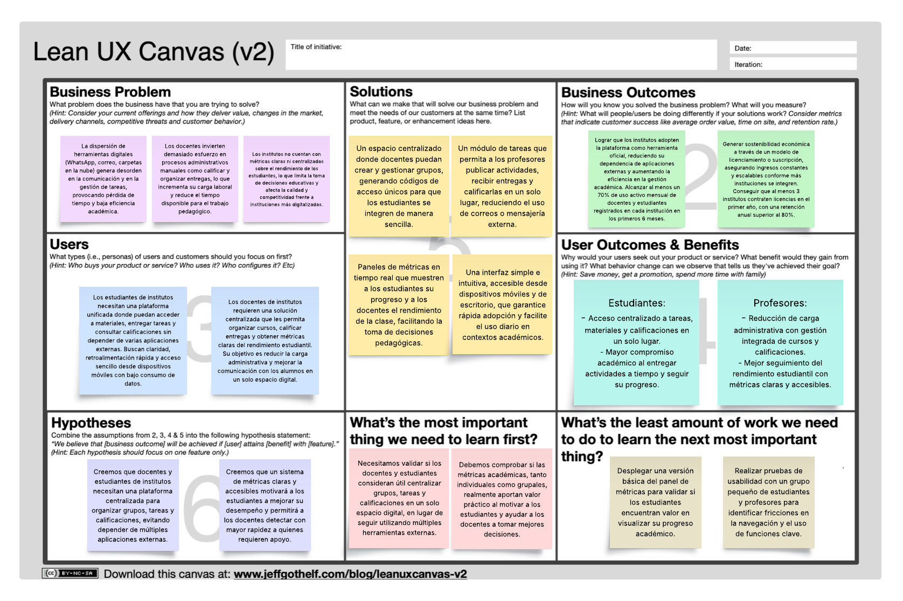

# Universidad Peruana de Ciencias Aplicadas

### **CURSO:** Fundamentos de Arquitectura de Software

### **NRC**: 6342

### **Profesor:** Abel Nehemias Rosales Caururu

### **Ingeniería de software**

## Informe de Trabajo Final

### **Nombre del startup:** APX-4

### **Nombre del producto:** LearnHive

## **Integrantes**

| **Nombre**                                | **Código** |
|-------------------------------------------|------------|
| **Alejo Cardenas, Jose Antonio**             | U202122484 |
| **Real Calderon, Sebastian Omar**       | U20221D964 |
| **Luquillas Asto, Omar** | U20211G641 |
| **Olivera Barzola, Eric Marlon**          | U202315032  |
| **Aliaga Urbina, Wilder Gonzalo**            | U202222001 |

**Septiembre 2025**

## Registro de Versiones del Informe

<table>
  <thead>
    <tr>
      <th>Versión</th>
      <th>Fecha</th>
      <th>Autor</th>
      <th>Descripción de modificación</th>
    </tr>
  </thead>
  <tbody>
    <tr>
      <td>0.1</td>
      <td>03/09/25</td>
      <td>Jose Alejo</td>
      <td>Elaboración de plantilla del reporte</td>
    </tr>
  </tbody>
</table>

# Contenido  

- [Student Outcome](#student-outcome) → Ver anexo A al final de este documento  

- [Capítulo I: Introducción](#capítulo-i-introducción)  
  - [1.1 Startup Profile](#11-startup-profile)  
    - [1.1.1 Descripción de la Startup](#111-descripción-de-la-startup)  
    - [1.1.2 Perfiles de integrantes del equipo](#112-perfiles-de-integrantes-del-equipo)  
  - [1.2 Solution Profile](#12-solution-profile)  
    - [1.2.1 Nombre del producto](#121-nombre-del-producto)  
    - [1.2.2 Antecedentes y problemática](#122-antecedentes-y-problemática)  
    - [1.2.3 Lean UX Process](#123-lean-ux-process)  
      - [1.2.3.1 Lean UX Problem Statement](#1231-lean-ux-problem-statement)  
      - [1.2.3.2 Lean UX Assumptions](#1232-lean-ux-assumptions)  
      - [1.2.3.3 Lean UX Hypothesis](#1233-lean-ux-hypothesis)  
      - [1.2.3.4 Lean UX Canvas](#1234-lean-ux-canvas)  
  - [1.3 Segmentos objetivo](#13-segmentos-objetivo)  

- [Capítulo II: Requirements & Analysis](#capítulo-ii-requirements--analysis)  
  - [2.1 Competidores](#21-competidores)  
  - [2.2 Entrevistas](#22-entrevistas)  
  - [2.3 Needfinding](#23-needfinding)  
    - [2.3.1 User Personas](#231-user-personas)  
    - [2.3.2 User Task Matrix](#232-user-task-matrix)  
    - [2.3.3 Empathy Maps](#233-empathy-maps)  
    - [2.3.4 As-is Scenario Mapping](#234-as-is-scenario-mapping)  

- [Capítulo III: Requirements Specification](#capítulo-iii-requirements-specification)  
  - [3.1 To-Be Scenario Mapping](#31-to-be-scenario-mapping)  
  - [3.2 User Stories](#32-user-stories)  
  - [3.3 Impact Map](#33-impact-map)  
  - [3.4 Product Backlog (Avance1)](#34-product-backlog-avance1)  

- [Capítulo IV: Product Architecture Design](#capítulo-iv-product-architecture-design)  
  - [4.1 Design Concepts, ViewPoints & ER Diagrams](#41-design-concepts-viewpoints--er-diagrams)  
    - [4.1.1 Principles Statements](#411-principles-statements)  
    - [4.1.2 Approaches Statements Architectural Styles & Patterns](#412-approaches-statements-architectural-styles--patterns)  
    - [4.1.3 Context Diagram](#413-context-diagram)  
    - [4.1.4 Approach driven ViewPoints Diagrams](#414-approach-driven-viewpoints-diagrams)  
    - [4.1.5 Relational/Non Relational Database Diagram](#415-relationalnon-relational-database-diagram)  
    - [4.1.6 Design Patterns](#416-design-patterns)  
    - [4.1.7 Tactics](#417-tactics)  
  - [4.2 Architectural Drivers](#42-architectural-drivers)  
    - [4.2.1 Design Purpose](#421-design-purpose)  
    - [4.2.2 Primary Functionality (Primary User Stories)](#422-primary-functionality-primary-user-stories)  
    - [4.2.3 Quality Attribute Scenarios](#423-quality-attribute-scenarios)  
    - [4.2.4 Constraints](#424-constraints)  
    - [4.2.5 Architectural Concerns](#425-architectural-concerns)  
  - [4.3 ADD Iterations](#43-add-iterations)  
    - [4.3.X Iteration N: <Iteration Name>](#43x-iteration-n-iteration-name)  
      - [4.3.X.1 Architectural Design Backlog N](#43x1-architectural-design-backlog-n)  
      - [4.3.X.2 Establish Iteration Goal by Selecting Drivers](#43x2-establish-iteration-goal-by-selecting-drivers)  
      - [4.3.X.3 Choose Elements to Refine](#43x3-choose-elements-to-refine)  
      - [4.3.X.4 Choose Design Concepts That Satisfy Drivers](#43x4-choose-design-concepts-that-satisfy-drivers)  
      - [4.3.X.5 Instantiate Elements, Allocate Responsibilities & Define Interfaces](#43x5-instantiate-elements-allocate-responsibilities--define-interfaces)  
      - [4.3.X.6 Sketch Views (C4 & UML) and Record Design Decisions](#43x6-sketch-views-c4--uml-and-record-design-decisions)  
      - [4.3.X.7 Analysis & Review (Kanban Board) (Avance 2)](#43x7-analysis--review-kanban-board-avance-2)  

- [Capítulo V: Product Implementation, Validation & Deployment](#capítulo-v-product-implementation-validation--deployment)  
  - [5.1 Testing Suites & General Patterns](#51-testing-suites--general-patterns)  
    - [5.1.1 Backend Application Core Testing Suite](#511-backend-application-core-testing-suite)  
    - [5.1.2 Pattern Based Backend Application(s)](#512-pattern-based-backend-applications)  
    - [5.1.3 Pattern Based Custom Software Library](#513-pattern-based-custom-software-library)  
    - [5.1.4 Framework Pattern Driven Refactoring Report](#514-framework-pattern-driven-refactoring-report)  
  - [5.2 Software Configuration Management](#52-software-configuration-management)  
    - [5.2.1 Software Development Environment Configuration](#521-software-development-environment-configuration)  
    - [5.2.2 Source Code Management](#522-source-code-management)  
    - [5.2.3 Source Code Style Guide & Conventions](#523-source-code-style-guide--conventions)  
    - [5.2.4 Software Deployment Configuration](#524-software-deployment-configuration)  
  - [5.3 Microservices Implementation](#53-microservices-implementation)  
    - [Sprint 1 (TP1)](#sprint-1-tp1)  
    - [Sprint 2 (Avance 3)](#sprint-2-avance-3)  
    - [Sprint 3 (Avance 4)](#sprint-3-avance-4)  
    - [Sprint 4](#sprint-4)  
  - [5.4 Microservices Deployment](#54-microservices-deployment)  
    - [5.4.1 Cloud Architecture Diagram](#541-cloud-architecture-diagram)  
    - [5.4.2 Cloud Architecture Deployment (AWS, Azure o GCP)](#542-cloud-architecture-deployment-aws-azure-o-gcp)  

- [Conclusiones](#conclusiones)  
  - [Conclusiones y recomendaciones](#conclusiones-y-recomendaciones)  
  - [Video About-The-Team](#video-about-the-team)  

- [Referencias Bibliográficas](#referencias-bibliográficas)  

- [Anexos](#anexos)  
  
- [Links](#links)  

# Student Outcome

| Criterio específico | Acciones realizadas | Conclusiones |
|----------------------|---------------------|--------------|
| **Actualiza conceptos y conocimientos necesarios para su desarrollo profesional y en especial para su proyecto en soluciones de software.** | **Alejo Cardenas, Jose Antonio** TB1: AAA… TB2: BBB… **Real Calderon, Sebastian Omar** TB1: AAA… **Luquillas Asto, Omar** TB1: AAA…  **Olivera Barzola, Eric Marlon** TB1: AAA…  **Aliaga Urbina, Wilder Gonzalo** TB1: AAA…  | AAA… |
| **Reconoce la necesidad del aprendizaje permanente para el desempeño profesional y el desarrollo de proyectos en soluciones de software.** | **Alejo Cardenas, Jose Antonio** TB1: BBB… TB2: BBB… **Real Calderon, Sebastian Omar** TB1: BBB… **Luquillas Asto, Omar** TB1: BBB…  **Olivera Barzola, Eric Marlon** TB1: BBB…  **Aliaga Urbina, Wilder Gonzalo** TB1: BBB…  | BBB... |

# Capítulo I: Introducción

## 1.1 Startup Profile

### 1.1.1 Descripción de la Startup

APX-4 es una startup innovadora, fundada por estudiantes de la Universidad Peruana de Ciencias Aplicadas (UPC), con la misión de revolucionar la educación en el Perú mediante soluciones tecnológicas accesibles y de alto impacto.

Nuestro producto principal, LearnHive, es una plataforma integral de analytics y gestión educativa diseñada específicamente para los institutos de Lima Metropolitana que carecen de un sistema de data unificado. LearnHive se integra con los sistemas existentes o permite el ingreso manual de datos, para centralizar la información académica y transformarla en insights visuales y procesables.

Para los profesores, ofrecemos un dashboard intuitivo que les permite supervisar el estado general de sus cursos en tiempo real. Esta visión integral les facilita el monitoreo continuo del progreso del aula, asegurando que siempre tengan el pulso de su clase.

Por otro lado, para los alumnos, proporcionamos un portal de acceso seguro donde pueden visualizar sus propias estadísticas y progreso académico de forma clara y transparente. Este acceso empodera a los estudiantes, dándoles ownership de su propio recorrido educativo.

Misión:
Potenciar el éxito académico en los institutos de Lima Metropolitana mediante una plataforma de analytics educativa intuitiva y poderosa. Brindamos a los educadores las herramientas basadas en datos para tomar decisiones proactivas e impactar positivamente en el aprendizaje de cada estudiante.

Visión:
Ser la plataforma de analytics y gestión educativa de referencia en Lima Metropolitana, reconocida por transformar la data académica en insights accionables que elevan la calidad de la enseñanza y convierten a los institutos en centros de innovación pedagógica.

### 1.1.2 Perfiles de integrantes del equipo

<table>
  <tr>
    <th colspan="2"> Jose Antonio Alejo Cardenas </th>
  </tr>
  <tr>
    <td>  </td>
    <td> Soy José Alejo Cárdenas, estudiante de la carrera de Ingeniería de Software. Desde pequeño he sentido facinacion por la tecnologia en general sobretodo por el funcionamiento, desarrollo y proteccion del software en el ambito de ciberseguridad. He estudiado lenguajes de programacion (javascript, python y C++), bases de datos (Microsoft SQL Server y Mongo DB) y Sistemas Operativos (Kali Linux y Windows). Asi mismo, tengo experiencia con hardware a nivel de esamblamiento de equipos y funcionamiento del mismo con sus especificaciones tecnicas. Además, mi constante comunicacion y organizacion durante cualquier trabajo grupal aportara mucho dinamismo al proyecto. Mis principales hobbies son entrenar en el gimnasio, jugar videojuegos con mis amigos y salir a conversar con estos ultimos durante algun almuerzo o cena. Para el proyecto aportare organizacion, comunicacion e inspiracion durante todo el transcurso del mismo. </td>
  </tr>
  <tr>
    <th colspan="2"> Sebastián Omar Real Calderón </th>
  </tr>
  <tr>
    <td>  </td>
    <td> Soy Sebastián Real Calderón, estudiante de Ingeniería de Software. Tengo conocimiento de diferentes lenguajes de programación, como C#, C++ y Java. Mi mayor objetivo al desarrollar software es crear una experiencia de usuario con la que los consumidores puedan sentirse satisfechos al trabajar con nuestras aplicaciones. Asimismo, aspiro a ser un buen participante al mantener una comunicación constante con mis compañeros, resolviendo problemas y apoyándo a quién lo necesite para crear un ambiente cómodo para todos. </td>
  </tr>
  <tr>
    <th colspan="2"> Omar Luquillas Asto </th>
  </tr>
  <tr>
    <td>  </td>
    <td> Soy Omar Luquillas Asto, estudiante de la carrera de Ingeniería de Software. Elegí esta carrera porque me apasiona la tecnología, el desarrollo de software y la programación. Tengo conocimientos en lenguajes de programación como C++, Python y Java. Me considero una persona investigadora, ya que me gusta aprender cosas nuevas y siempre estoy en busca de soluciones creativas e innovadoras que generen un impacto positivo en la vida de las personas. Además, valoro el trabajo en equipo, soy responsable y me comprometo a cumplir con mis tareas de manera eficiente. </td>
  </tr>
  <tr>
    <th colspan="2">Wilder Gonzalo Aliaga Urbina</th>
  </tr>
  <tr>
    <td>  </td>
    <td>Como estudiante universitario de 20 años y cursando la carrera de Ingeniería de Software, tengo una sólida base en programación en C++, Python, HTML y CSS, además de habilidades en creatividad y organización grupal. Mi enfoque está en fomentar un ambiente de aprendizaje eficiente y participativo en equipo. Me apasiona encontrar soluciones innovadoras y siempre estoy dispuesto a aprender nuevas tecnologías que potencien mis proyectos. He trabajado en proyectos colaborativos donde la comunicación y la planificación fueron claves para lograr buenos resultados. Mi objetivo es seguir creciendo profesionalmente mientras contribuyo activamente al desarrollo de iniciativas tecnológicas con impacto positivo. </td>
  </tr>
  <tr>
    <th colspan="2">-</th>
  </tr>
  <tr>
    <td>  </td>
    <td>  </td>
  </tr>
</table>

## 1.2 Solution Profile
### 1.2.1 Nombre del producto

El producto desarrollado se denomina LearnHive. LearnHive busca ofrecer una herramienta digital integral que facilite la gestión de grupos, actividades y métricas de desempeño estudiantil, adaptándose a las necesidades de docentes y estudiantes en entornos que carecen de plataformas propias de gestión académica.

### 1.2.2 Antecedentes y problemática

**1. What / ¿QUÉ?**

- ¿Cuál es el problema?

El problema principal es la falta de un entorno educativo digital unificado y accesible en muchos institutos de Lima, lo que resulta en una gestión docente ineficiente (uso de herramientas dispersas como WhatsApp y correo), dificultad para centralizar y evaluar el trabajo de los estudiantes, y una incapacidad para obtener una visión clara del rendimiento académico de la clase. Esto lleva a una experiencia de aprendizaje fragmentada y reactiva, tanto para profesores como para alumnos.

- ¿Cuál es la relación con la persona en cuestión?

La relación se establece a través del instituto, que adopta LearnHive como su plataforma oficial. El profesor es nuestro usuario principal y cliente directo, ya que es quien gestiona los cursos, califica y analiza el desempeño. El profesor utiliza LearnHive para estructurar su curso, comunicarse con los estudiantes y transformar su rol de evaluador reactivo a gestor proactivo del aprendizaje. El estudiante accede a la plataforma como usuario final, encontrando un espacio centralizado para sus cursos, tareas y calificaciones, permitiéndole gestionar sus trabajos con mayor facilidad.

**2. When / ¿CUÁNDO?**

- ¿Cuándo sucede el problema?

El problema ocurre diariamente durante el ciclo académico:

Para el profesor: Al intentar organizar y publicar materiales para cada clase, al recibir decenas de entregas por diferentes canales, y al momento de calificar y consolidar esas notas manualmente en una hoja de cálculo. También surge al final del ciclo académico, cuando necesita analizar las notas para generar reportes de desempeño, un proceso que suele ser manual.

Para el estudiante: Al no tener un lugar claro donde consultar las tareas, materiales o fechas de entrega, y al tener que enviar sus trabajos a través de medios informales que no garantizan su recepción correcta. Así como no tener una plataforma que unifique todas las funcionalidades del sistema educativo.

- ¿Cuándo utiliza el cliente el producto?

El profesor lo usa de forma constante para revisar avances, publicar anuncios y/o trabajos y calificar entregas. De la misma manera, puede ver el desempeño de sus alumnos en tiempo real con métricas que se actualizan diariamente.

El estudiante accede a la plataforma a diario para verificar sus cursos, las tareas pendientes y los anuncios nuevos, y de manera puntual para subir sus entregas antes de la fecha límite y consultar sus calificaciones.

**3. Where / ¿DÓNDE?**

- ¿Dónde está el cliente cuando usa el producto?

Tanto profesores como estudiantes acceden a LearnHive principalmente desde sus dispositivos móviles y computadoras portátiles o de escritorio, desde cualquier lugar con conexión a internet: en el instituto, en sus hogares o en movimiento.

- ¿Dónde surge el problema?

El problema surge en el entorno educativo mismo:

En la sala de profesores y el domicilio del docente, donde se invierten tiempo en organizar, calificar y compilar información de manera manual.

En el entorno del estudiante, que se ve obligado a navegar entre múltiples apps y chats para gestionar su aprendizaje.

**4. Who / ¿QUIÉN?**

- ¿Quienes se ven involucrados en el problema?

El problema involucra directamente a los profesores y estudiantes, quienes son los más afectados por la gestión educativa desorganizada. Los profesores cargan con la pesada administración manual, mientras que los estudiantes enfrentan una experiencia de aprendizaje fragmentada. Indirectamente, los directores de los institutos y los padres de familia también se ven perjudicados, ya que carecen de acceso claro a datos sobre el rendimiento.

- ¿Cuáles son las causas del problema?

La causa fundamental del problema es una brecha digital y económica que limita el acceso a herramientas tecnológicas asequibles y fáciles de usar, junto con una falta de capacitación que genera resistencia al cambio en muchos entornos educativos.

**5. Why / ¿POR QUÉ?**

¿Por qué sucede el problema?

Sucede porque muchos institutos de Lima carecen de los recursos financieros y técnicos para desarrollar, implementar y mantener una plataforma educativa propia y robusta. Las soluciones existentes en el mercado pueden ser demasiado costosas, genéricas o complejas para sus necesidades específicas. Esto los fuerza a depender de herramientas gratuitas pero no diseñadas para la educación (servicios de mensajería o correo electrónico), lo que genera desorganización, pérdida de información y una carga administrativa insostenible para el docente.
Asi mismo, porque las plataformas actuales (ej. Google Classroom, Blackboard) están enfocadas en universidades o colegios con mayores recursos tecnológicos y no contemplan las necesidades específicas de los institutos académicos, como la simplicidad, la creación ágil de grupos con códigos de ingreso o la disponibilidad de métricas personalizadas.

**6. How / ¿CÓMO?**

- ¿En qué condiciones los clientes usan nuestro producto?

Los clientes utilizan LearnHive principalmente a través de un navegador web o una aplicación móvil, dependiendo de una conexión a internet accesible. La plataforma está diseñada para ser usada de forma asíncrona, permitiendo que profesores y estudiantes interactúen con el contenido en los momentos que más les convengan. La usabilidad es fundamental, por lo que la interfaz debe ser extremadamente intuitiva para garantizar una adopción rápida y sin fricciones, minimizando la necesidad de una capacitación extensa.

- ¿Cómo se diferencia el problema del estado normal (óptimo)?

En un estado óptimo, los estudiantes y docentes deberían gestionar grupos, tareas y métricas desde una única plataforma sencilla y adaptada a sus necesidades. Actualmente, deben recurrir a múltiples aplicaciones externas, lo que genera desorganización, duplicidad de esfuerzos y pérdida de información.

- ¿La tendencia en la que aparece el problema es aleatoria o sigue un patrón?

Sigue un patrón claro: aparece en cada ciclo académico, especialmente cuando se requiere colaboración grupal o evaluaciones conjuntas.

**7. How Much / ¿CUÁNTO?**

- ¿Cuántos problemas se dan en un día, una semana o un mes?

En promedio, los docentes dedican entre 5 y 5.9 horas por semana (equivalentes a casi seis semanas al año) a tareas administrativas como seguimiento, calificación y organización de actividades académicas. Estas cargas generan dificultades de coordinación varias veces por semana, sobre todo en etapas críticas del curso. 

- ¿Cuánto dinero están implicando?

Aunque no hay un gasto monetario directo, el tiempo invertido representa un costo de oportunidad importante. Si una plataforma como LearnHive logra automatizar procesos básicos, podría ahorrar a los docentes entre 1 y 2 horas por semana, lo que a nivel institucional significaría hasta un 30 % de mejora en eficiencia de gestión y un impacto directo en la calidad educativa.

### 1.2.3 Lean UX Process

El Lean UX Process es una metodología de diseño centrada en el usuario que busca trabajar de forma práctica y ágil. Su enfoque se basa en realizar ciclos cortos de creación, prueba y mejora, lo que permite validar rápidamente si una idea realmente responde a las necesidades de los usuarios. A diferencia de los métodos tradicionales que requieren mucha documentación, Lean UX da más importancia a la retroalimentación constante y al trabajo en equipo, asegurando que el producto evolucione de acuerdo con la experiencia real de los estudiantes y docentes. De esta forma, se pueden identificar y corregir fallas a tiempo, evitando desperdicio de recursos y garantizando una solución más cercana a lo que el usuario necesita.

#### 1.2.3.1 Lean UX Problem Statement

Nuestra plataforma tiene como propósito optimizar la gestión académica y la interacción entre estudiantes y docentes de institutos en un único espacio digital. Hemos detectado que gran parte de los usuarios continúa utilizando herramientas aisladas y poco integradas, como WhatsApp, correo electrónico o carpetas en la nube, lo que complica la organización de grupos, asignaciones y entregas. Este escenario provoca desorden, desperdicio de tiempo y una comunicación menos efectiva, afectando en el desempeño de los estudiantes y aumentando la carga administrativa de los docentes. ¿Cómo podemos mejorar nuestra solución para que los estudiantes y docentes de institutos coordinen sus actividades académicas de forma más ágil, evaluando el éxito mediante una mayor participación en los grupos, un mejor cumplimiento de las tareas y una reducción del tiempo dedicado a la organización?

#### 1.2.3.2 Lean UX Assumptions

**User Assumptions (Suposiciones de Usuario)**

- ¿Quién es el usuario?: Los usuarios principales son docentes y estudiantes de institutos de Lima Metropolitana. Los profesores buscan simplificar la gestión de cursos, centralizar entregas y contar con métricas claras de rendimiento. Los estudiantes necesitan un espacio único para organizar sus actividades, consultar tareas y visualizar su progreso académico.
- ¿Dónde encaja nuestro producto en su trabajo o vida?: LearnHive se integra como una herramienta de uso cotidiano en el entorno académico del instituto. Para los profesores, funciona como un panel central para planificar, evaluar y dar seguimiento al rendimiento de la clase. Para los estudiantes, se convierte en el espacio digital donde concentran todas sus responsabilidades académicas.
- ¿Qué problemas resuelve nuestro producto?: Resuelve la dispersión de herramientas informales (WhatsApp, correo, hojas de cálculo), la dificultad para consolidar información académica y la falta de indicadores accesibles para la toma de decisiones pedagógicas.
- ¿Cuándo y cómo se usa nuestro producto?: El docente utiliza la plataforma de manera continua durante el ciclo académico: al crear grupos, publicar materiales, calificar entregas y revisar métricas de desempeño. El estudiante accede diariamente para consultar tareas, subir trabajos y verificar sus calificaciones.
- ¿Qué características son importantes?: Las funcionalidades clave incluyen la gestión de grupos, publicación de materiales y tareas, calificación centralizada, métricas académicas en tiempo real y un portal de estudiante con acceso seguro a estadísticas personalizadas.
- ¿Cómo debe verse y comportarse nuestro producto?: Debe tener un diseño simple, profesional e intuitivo, con tiempos de respuesta rápidos y una experiencia de navegación que minimice la curva de aprendizaje, fomentando la adopción inmediata tanto por profesores como estudiantes.

**Business Assumptions (Suposiciones de Negocio)**

- Necesidades y problemas: Los institutos requieren una plataforma accesible y adaptada a su realidad económica y tecnológica, que mejore la organización académica sin generar altos costos de implementación.
- Plataforma: Una aplicación web y móvil garantiza accesibilidad y flexibilidad en distintos entornos de uso.
- Segmentación: El público objetivo está conformado por docentes y estudiantes de institutos académicos de Lima Metropolitana.
- Comportamientos: Se espera que los usuarios valoren la simplicidad, la centralización de funciones y la posibilidad de contar con métricas claras y accionables.
- Beneficios: Los usuarios obtendrán mayor organización, reducción del tiempo administrativo, mejora en la comunicación y un seguimiento más claro del rendimiento académico.
- Captación de clientes: La estrategia de captación incluye presentaciones directas a directivos de institutos, convenios institucionales, además de difusión en redes sociales.
- Modelos de ingresos: LearnHive se plantea como un sistema ofrecido bajo licenciamiento o suscripción a institutos, generando sostenibilidad económica para la startup.
- Competencia: Las plataformas existentes como Google Classroom o Blackboard se dirigen a universidades y colegios con mayores recursos, lo que deja un espacio poco atendido en los institutos.
- Ventaja competitiva: LearnHive destaca por su enfoque en la simplicidad, la adaptabilidad al contexto de los institutos y la integración de métricas personalizadas que no suelen estar disponibles en soluciones genéricas.

**Technical Assumptions (Suposiciones Técnicas)**

- Tecnología utilizada: Se emplearán tecnologías web modernas y escalables que aseguren estabilidad y compatibilidad con navegadores y dispositivos móviles.
- Integraciones: El sistema podrá integrarse con fuentes externas de datos o aceptar carga manual, asegurando flexibilidad para distintos niveles de digitalización institucional.
- Escalabilidad: La infraestructura estará diseñada para crecer en usuarios y datos sin afectar la velocidad de respuesta.

**Market Assumptions (Suposiciones de Mercado)**

- Tamaño del mercado: El mercado objetivo incluye a los institutos de Lima Metropolitana que actualmente no cuentan con plataformas propias de gestión académica.
- Competencia: Los competidores son plataformas más genéricas que no se adaptan a las necesidades específicas de los institutos.
- Tendencias: Existe una tendencia clara hacia la digitalización de la educación en el nivel técnico y superior, impulsada por la necesidad de modernización y eficiencia en la gestión académica.

**Design Assumptions (Suposiciones de Diseño)**

- Interacción del usuario: La interfaz debe permitir una navegación sencilla y accesible para usuarios con distintos niveles de familiaridad tecnológica.
- Experiencia del usuario: El diseño debe priorizar la claridad visual y la reducción de pasos innecesarios en cada acción.
- Colores y tipografía: Se buscará una paleta que transmita seriedad y confianza, acompañada de tipografías modernas y legibles.
- Preferencias visuales: El diseño debe ser atractivo, pero sin sobrecargar la vista; el enfoque debe estar en las funciones académicas principales.
- Prototipos y pruebas: Se realizarán validaciones de las funcionalidades principales mediante pruebas de usabilidad, con el objetivo de asegurar que la plataforma cumpla con las expectativas de los usuarios.

#### 1.2.3.3 Lean UX Hypothesis

Hypothesis Statement 01:

- Creemos que los docentes y estudiantes de institutos necesitan una plataforma centralizada para gestionar sus actividades académicas y mantener una comunicación más fluida.
- Sabremos que estamos en lo correcto cuando veamos un uso constante de la plataforma en el día a día académico y recibamos retroalimentación positiva sobre la organización que esta ofrece.

Hypothesis Statement 02:

- Creemos que la desarticulación entre las herramientas que actualmente utilizan es la principal causa de desorden y pérdida de información en los institutos.
- Sabremos que estamos en lo correcto cuando los usuarios dejen de depender de múltiples aplicaciones externas y disminuyan las quejas relacionadas con la desorganización.

Hypothesis Statement 03:

- Creemos que permitir la creación y gestión de grupos académicos dentro de la plataforma fomentará una colaboración más activa entre los estudiantes.
- Sabremos que estamos en lo correcto cuando identifiquemos un incremento en la cantidad de grupos creados y en el nivel de participación dentro de ellos.

Hypothesis Statement 04:

- Creemos que ofrecer un módulo para centralizar materiales, tareas y fechas de entrega ayudará a los estudiantes a planificar mejor sus responsabilidades.
- Sabremos que estamos en lo correcto cuando los estudiantes reporten mayor claridad en la gestión de sus cursos y menos confusión respecto a los plazos.

Hypothesis Statement 05:

- Creemos que un sistema de métricas y reportes en tiempo real permitirá a los docentes hacer un seguimiento más eficiente del rendimiento académico de sus estudiantes.
- Sabremos que estamos en lo correcto cuando los profesores utilicen activamente estas métricas para ajustar sus clases y estrategias pedagógicas.

Hypothesis Statement 06:

- Creemos que una interfaz simple e intuitiva facilitará la adopción de la plataforma por parte de usuarios con distintos niveles de familiaridad tecnológica.
- Sabremos que estamos en lo correcto cuando los nuevos usuarios logren manejar la plataforma de manera autónoma en sus primeras semanas de uso.

Hypothesis Statement 07:

- Creemos que mostrar de manera visual los avances y estadísticas individuales motivará a los estudiantes a involucrarse más con su aprendizaje.
- Sabremos que estamos en lo correcto cuando los estudiantes revisen con frecuencia su panel de progreso y expresen satisfacción con esta funcionalidad.

Hypothesis Statement 08:

- Creemos que garantizar la privacidad y seguridad de la información académica será un factor decisivo para la adopción institucional de la plataforma.
- Sabremos que estamos en lo correcto cuando no existan incidentes de seguridad y los usuarios manifiesten confianza en el manejo de sus datos.

Hypothesis Statement 09:

- Creemos que centralizar la entrega y calificación de tareas dentro de la plataforma optimizará la dinámica académica y reducirá la necesidad de usar correos o mensajería externa.
- Sabremos que estamos en lo correcto cuando los docentes y estudiantes utilicen mayoritariamente esta funcionalidad y se reduzca el uso de canales alternativos para estas actividades.

Hypothesis Statement 10:

- Creemos que la creciente tendencia hacia la educación híbrida y digital incrementará la necesidad de contar con soluciones tecnológicas integradas en los institutos.
- Sabremos que estamos en lo correcto cuando observemos un crecimiento sostenido en el número de instituciones que adoptan la plataforma en ciclos académicos presenciales, híbridos y virtuales.

Hypothesis Statement 11:

- Creemos que permitir a los docentes generar un código de acceso único para cada grupo facilitará la integración de estudiantes en el aula virtual.
- Sabremos que estamos en lo correcto cuando observemos que la mayoría de los estudiantes se registran correctamente mediante este sistema sin requerir asistencia adicional.

Hypothesis Statement 12:

- Creemos que la función para que los estudiantes se unan mediante códigos reducirá los errores en el registro y agilizará el manejo de grupos.
- Sabremos que estamos en lo correcto cuando identifiquemos menos casos de estudiantes que no logran acceder al grupo correcto.

Hypothesis Statement 13:

- Creemos que la posibilidad de que los docentes eliminen a alumnos de los grupos ayudará a mantener un control más ordenado de la plataforma virtual.
- Sabremos que estamos en lo correcto cuando los docentes gestionen cambios de grupo sin generar confusión en el resto de los estudiantes.

Hypothesis Statement 14:

- Creemos que las estadísticas globales de los estudiantes permitirán a los docentes monitorear el progreso general de su clase.
- Sabremos que estamos en lo correcto cuando los profesores consulten estas métricas con frecuencia y las usen para ajustar sus estrategias de enseñanza.

Hypothesis Statement 15:

- Creemos que la opción de revisar y calificar tareas dentro de la plataforma optimizará el trabajo docente y reducirá la dependencia de medios externos.
- Sabremos que estamos en lo correcto cuando los profesores entreguen calificaciones dentro del sistema y disminuya el uso de correos o mensajería externa para enviar resultados.

Hypothesis Statement 16:

- Creemos que el acceso de los estudiantes a sus propias métricas de desempeño los motivará a mejorar en sus tareas y actividades.
- Sabremos que estamos en lo correcto cuando los estudiantes revisen con frecuencia su panel de métricas y reporten mayor claridad sobre su progreso académico.

Hypothesis Statement 17:

- Creemos que la centralización de grupos, tareas y calificaciones en un solo espacio reducirá la confusión que suele generar el uso de múltiples aplicaciones.
- Sabremos que estamos en lo correcto cuando los usuarios manifiesten que ya no necesitan apoyarse en varias herramientas externas para organizar su vida académica.

Hypothesis Statement 18:

- CCreemos que un dashboard para el docente enfocada en la gestión de grupos y calificaciones facilitará la adopción de la plataforma por parte del profesorado.
- Sabremos que estamos en lo correcto cuando los docentes logren administrar sus grupos de manera autónoma después de un breve periodo de adaptación.

Hypothesis Statement 19:

- Creemos que la visualización de métricas individuales por estudiante ayudará a los docentes a identificar con mayor rapidez a quienes requieren apoyo adicional.
- Sabremos que estamos en lo correcto cuando los profesores utilicen estas métricas para tomar decisiones pedagógicas y reporten que la detección temprana fue efectiva.

Hypothesis Statement 20:

- Creemos que validar la experiencia de estudiantes y docentes mediante pruebas de usabilidad permitirá detectar oportunidades de mejora antes del despliegue final.
- Sabremos que estamos en lo correcto cuando los resultados de estas pruebas conduzcan a ajustes que incrementen la satisfacción general de los usuarios.

#### 1.2.3.4 Lean UX Canvas

## 1.3 Segmentos objetivo

# Capítulo II: Requirements & Analysis

## 2.1 Competidores
## 2.2 Entrevistas
## 2.3 Needfinding
### 2.3.1 User Personas
### 2.3.2 User Task Matrix
### 2.3.3 Empathy Maps
### 2.3.4 As-is Scenario Mapping

# Capítulo III: Requirements Specification

## 3.1 To-Be Scenario Mapping
## 3.2 User Stories
## 3.3 Impact Map
## 3.4 Product Backlog (Avance1)

# Capítulo IV: Product Architecture Design

## 4.1 Design Concepts, ViewPoints & ER Diagrams
### 4.1.1 Principles Statements
### 4.1.2 Approaches Statements Architectural Styles & Patterns
### 4.1.3 Context Diagram
### 4.1.4 Approach driven ViewPoints Diagrams
### 4.1.5 Relational/Non Relational Database Diagram
### 4.1.6 Design Patterns
### 4.1.7 Tactics

## 4.2 Architectural Drivers
### 4.2.1 Design Purpose
### 4.2.2 Primary Functionality (Primary User Stories)
### 4.2.3 Quality Attribute Scenarios
### 4.2.4 Constraints
### 4.2.5 Architectural Concerns

## 4.3 ADD Iterations
### 4.3.X Iteration N: <Iteration Name>
#### 4.3.X.1 Architectural Design Backlog N
#### 4.3.X.2 Establish Iteration Goal by Selecting Drivers
#### 4.3.X.3 Choose Elements to Refine
#### 4.3.X.4 Choose Design Concepts That Satisfy Drivers
#### 4.3.X.5 Instantiate Elements, Allocate Responsibilities & Define Interfaces
#### 4.3.X.6 Sketch Views (C4 & UML) and Record Design Decisions
#### 4.3.X.7 Analysis & Review (Kanban Board) (Avance 2)

# Capítulo V: Product Implementation, Validation & Deployment

## 5.1 Testing Suites & General Patterns
### 5.1.1 Backend Application Core Testing Suite
### 5.1.2 Pattern Based Backend Application(s)
### 5.1.3 Pattern Based Custom Software Library
### 5.1.4 Framework Pattern Driven Refactoring Report

## 5.2 Software Configuration Management
### 5.2.1 Software Development Environment Configuration
### 5.2.2 Source Code Management
### 5.2.3 Source Code Style Guide & Conventions
### 5.2.4 Software Deployment Configuration

## 5.3 Microservices Implementation

### Sprint 1 (TP1)
#### 5.3.1.1 Sprint Backlog 1
#### 5.3.1.2 Development Evidence for Sprint Review
#### 5.3.1.3 Testing Suite Evidence for Sprint Review
#### 5.3.1.4 Execution Evidence for Sprint Review
#### 5.3.1.5 Microservices Documentation Evidence for Sprint Review
#### 5.3.1.6 Software Deployment Evidence for Sprint Review
#### 5.3.1.7 Team Collaboration Insights during Sprint
#### 5.3.1.8 Kanban Board

### Sprint 2 (Avance 3)
#### 5.3.2.1 Sprint Backlog 2
#### 5.3.2.2 Development Evidence for Sprint Review
#### 5.3.2.3 Testing Suite Evidence for Sprint Review
#### 5.3.2.4 Execution Evidence for Sprint Review
#### 5.3.2.5 Microservices Documentation Evidence for Sprint Review
#### 5.3.2.6 Software Deployment Evidence for Sprint Review
#### 5.3.2.7 Team Collaboration Insights during Sprint
#### 5.3.2.8 Kanban Board

### Sprint 3 (Avance 4)
#### 5.3.3.1 Sprint Backlog 3
#### 5.3.3.2 Development Evidence for Sprint Review
#### 5.3.3.3 Testing Suite Evidence for Sprint Review
#### 5.3.3.4 Execution Evidence for Sprint Review
#### 5.3.3.5 Microservices Documentation Evidence for Sprint Review
#### 5.3.3.6 Software Deployment Evidence for Sprint Review
#### 5.3.3.7 Team Collaboration Insights during Sprint
#### 5.3.3.8 Kanban Board

### Sprint 4
#### 5.3.4.1 Sprint Backlog 4
#### 5.3.4.2 Development Evidence for Sprint Review
#### 5.3.4.3 Testing Suite Evidence for Sprint Review
#### 5.3.4.4 Execution Evidence for Sprint Review
#### 5.3.4.5 Microservices Documentation Evidence for Sprint Review
#### 5.3.4.6 Software Deployment Evidence for Sprint Review
#### 5.3.4.7 Team Collaboration Insights during Sprint
#### 5.3.4.8 Kanban Board

## 5.4 Microservices Deployment
### 5.4.1 Cloud Architecture Diagram
### 5.4.2 Cloud Architecture Deployment (AWS, Microsoft Azure o Google Cloud) → TF1

# Conclusiones
## Conclusiones y recomendaciones
## Video About-The-Team

# Referencias Bibliográficas

# Anexos
# Links
