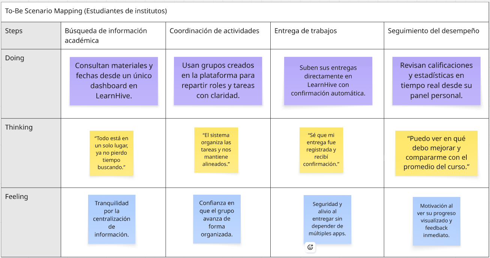
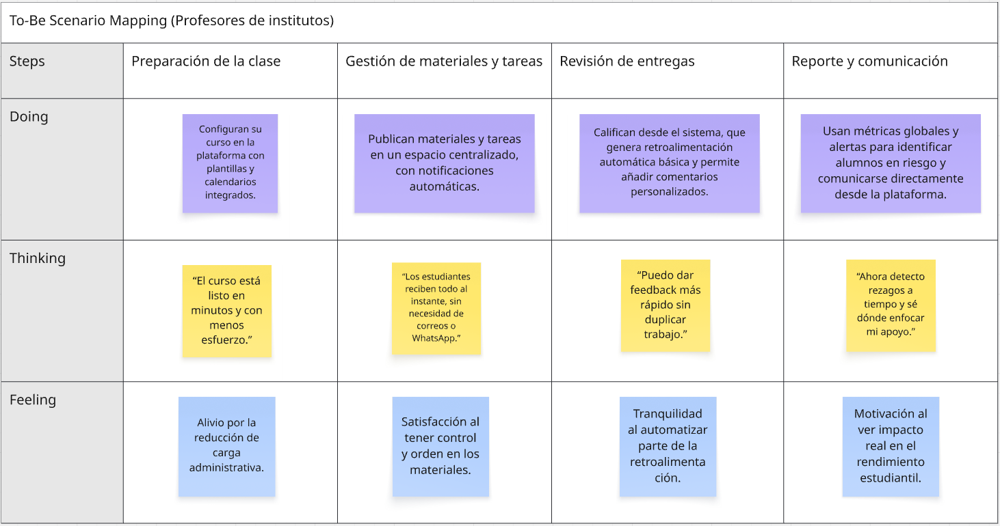
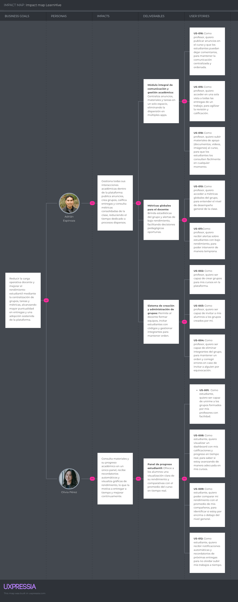

# Universidad Peruana de Ciencias Aplicadas

### **CURSO:** Fundamentos de Arquitectura de Software

### **NRC**: 6342

### **Profesor:** Abel Nehemias Rosales Caururu

### **Ingeniería de software**

## Informe de Trabajo Final

### **Nombre del startup:** APX-4

### **Nombre del producto:** LearnHive

## **Integrantes**

| **Nombre**                                | **Código** |
|-------------------------------------------|------------|
| **Alejo Cardenas, Jose Antonio**             | U202122484 |
| **Real Calderon, Sebastian Omar**       | U20221D964 |
| **Luquillas Asto, Omar** | U20211G641 |
| **Olivera Barzola, Eric Marlon**          | U202315032  |
| **Aliaga Urbina, Wilder Gonzalo**            | U202222001 |

**Septiembre 2025**

## Registro de Versiones del Informe

<table>
  <thead>
    <tr>
      <th>Versión</th>
      <th>Fecha</th>
      <th>Autor</th>
      <th>Descripción de modificación</th>
    </tr>
  </thead>
  <tbody>
    <tr>
      <td>0.1</td>
      <td>03/09/25</td>
      <td>Jose Alejo</td>
      <td>Elaboración de plantilla del reporte</td>
    </tr>
  </tbody>
</table>

# Contenido  

- [Student Outcome](#student-outcome) → Ver anexo A al final de este documento  

- [Capítulo I: Introducción](#capítulo-i-introducción)  
  - [1.1 Startup Profile](#11-startup-profile)  
    - [1.1.1 Descripción de la Startup](#111-descripción-de-la-startup)  
    - [1.1.2 Perfiles de integrantes del equipo](#112-perfiles-de-integrantes-del-equipo)  
  - [1.2 Solution Profile](#12-solution-profile)  
    - [1.2.1 Nombre del producto](#121-nombre-del-producto)  
    - [1.2.2 Antecedentes y problemática](#122-antecedentes-y-problemática)  
    - [1.2.3 Lean UX Process](#123-lean-ux-process)  
      - [1.2.3.1 Lean UX Problem Statement](#1231-lean-ux-problem-statement)  
      - [1.2.3.2 Lean UX Assumptions](#1232-lean-ux-assumptions)  
      - [1.2.3.3 Lean UX Hypothesis](#1233-lean-ux-hypothesis)  
      - [1.2.3.4 Lean UX Canvas](#1234-lean-ux-canvas)  
  - [1.3 Segmentos objetivo](#13-segmentos-objetivo)  

- [Capítulo II: Requirements & Analysis](#capítulo-ii-requirements--analysis)  
  - [2.1 Competidores](#21-competidores)  
  - [2.2 Entrevistas](#22-entrevistas)  
  - [2.3 Needfinding](#23-needfinding)  
    - [2.3.1 User Personas](#231-user-personas)  
    - [2.3.2 User Task Matrix](#232-user-task-matrix)  
    - [2.3.3 Empathy Maps](#233-empathy-maps)  
    - [2.3.4 As-is Scenario Mapping](#234-as-is-scenario-mapping)  

- [Capítulo III: Requirements Specification](#capítulo-iii-requirements-specification)  
  - [3.1 To-Be Scenario Mapping](#31-to-be-scenario-mapping)  
  - [3.2 User Stories](#32-user-stories)  
  - [3.3 Impact Map](#33-impact-map)  
  - [3.4 Product Backlog (Avance1)](#34-product-backlog-avance1)  

- [Capítulo IV: Product Architecture Design](#capítulo-iv-product-architecture-design)  
  - [4.1 Design Concepts, ViewPoints & ER Diagrams](#41-design-concepts-viewpoints--er-diagrams)  
    - [4.1.1 Principles Statements](#411-principles-statements)  
    - [4.1.2 Approaches Statements Architectural Styles & Patterns](#412-approaches-statements-architectural-styles--patterns)  
    - [4.1.3 Context Diagram](#413-context-diagram)  
    - [4.1.4 Approach driven ViewPoints Diagrams](#414-approach-driven-viewpoints-diagrams)  
    - [4.1.5 Relational/Non Relational Database Diagram](#415-relationalnon-relational-database-diagram)  
    - [4.1.6 Design Patterns](#416-design-patterns)  
    - [4.1.7 Tactics](#417-tactics)  
  - [4.2 Architectural Drivers](#42-architectural-drivers)  
    - [4.2.1 Design Purpose](#421-design-purpose)  
    - [4.2.2 Primary Functionality (Primary User Stories)](#422-primary-functionality-primary-user-stories)  
    - [4.2.3 Quality Attribute Scenarios](#423-quality-attribute-scenarios)  
    - [4.2.4 Constraints](#424-constraints)  
    - [4.2.5 Architectural Concerns](#425-architectural-concerns)  
  - [4.3 ADD Iterations](#43-add-iterations)  
    - [4.3.X Iteration N: <Iteration Name>](#43x-iteration-n-iteration-name)  
      - [4.3.X.1 Architectural Design Backlog N](#43x1-architectural-design-backlog-n)  
      - [4.3.X.2 Establish Iteration Goal by Selecting Drivers](#43x2-establish-iteration-goal-by-selecting-drivers)  
      - [4.3.X.3 Choose Elements to Refine](#43x3-choose-elements-to-refine)  
      - [4.3.X.4 Choose Design Concepts That Satisfy Drivers](#43x4-choose-design-concepts-that-satisfy-drivers)  
      - [4.3.X.5 Instantiate Elements, Allocate Responsibilities & Define Interfaces](#43x5-instantiate-elements-allocate-responsibilities--define-interfaces)  
      - [4.3.X.6 Sketch Views (C4 & UML) and Record Design Decisions](#43x6-sketch-views-c4--uml-and-record-design-decisions)  
      - [4.3.X.7 Analysis & Review (Kanban Board) (Avance 2)](#43x7-analysis--review-kanban-board-avance-2)  

- [Capítulo V: Product Implementation, Validation & Deployment](#capítulo-v-product-implementation-validation--deployment)  
  - [5.1 Testing Suites & General Patterns](#51-testing-suites--general-patterns)  
    - [5.1.1 Backend Application Core Testing Suite](#511-backend-application-core-testing-suite)  
    - [5.1.2 Pattern Based Backend Application(s)](#512-pattern-based-backend-applications)  
    - [5.1.3 Pattern Based Custom Software Library](#513-pattern-based-custom-software-library)  
    - [5.1.4 Framework Pattern Driven Refactoring Report](#514-framework-pattern-driven-refactoring-report)  
  - [5.2 Software Configuration Management](#52-software-configuration-management)  
    - [5.2.1 Software Development Environment Configuration](#521-software-development-environment-configuration)  
    - [5.2.2 Source Code Management](#522-source-code-management)  
    - [5.2.3 Source Code Style Guide & Conventions](#523-source-code-style-guide--conventions)  
    - [5.2.4 Software Deployment Configuration](#524-software-deployment-configuration)  
  - [5.3 Microservices Implementation](#53-microservices-implementation)  
    - [Sprint 1 (TP1)](#sprint-1-tp1)  
    - [Sprint 2 (Avance 3)](#sprint-2-avance-3)  
    - [Sprint 3 (Avance 4)](#sprint-3-avance-4)  
    - [Sprint 4](#sprint-4)  
  - [5.4 Microservices Deployment](#54-microservices-deployment)  
    - [5.4.1 Cloud Architecture Diagram](#541-cloud-architecture-diagram)  
    - [5.4.2 Cloud Architecture Deployment (AWS, Azure o GCP)](#542-cloud-architecture-deployment-aws-azure-o-gcp)  

- [Conclusiones](#conclusiones)  
  - [Conclusiones y recomendaciones](#conclusiones-y-recomendaciones)  
  - [Video About-The-Team](#video-about-the-team)  

- [Referencias Bibliográficas](#referencias-bibliográficas)  

- [Anexos](#anexos)  
  
- [Links](#links)  

# Student Outcome

| Criterio específico | Acciones realizadas | Conclusiones |
|----------------------|---------------------|--------------|
| **Actualiza conceptos y conocimientos necesarios para su desarrollo profesional y en especial para su proyecto en soluciones de software.** | **Alejo Cardenas, Jose Antonio** TB1: AAA… TB2: BBB… **Real Calderon, Sebastian Omar** TB1: AAA… **Luquillas Asto, Omar** TB1: AAA…  **Olivera Barzola, Eric Marlon** TB1: AAA…  **Aliaga Urbina, Wilder Gonzalo** TB1: AAA…  | AAA… |
| **Reconoce la necesidad del aprendizaje permanente para el desempeño profesional y el desarrollo de proyectos en soluciones de software.** | **Alejo Cardenas, Jose Antonio** TB1: BBB… TB2: BBB… **Real Calderon, Sebastian Omar** TB1: BBB… **Luquillas Asto, Omar** TB1: BBB…  **Olivera Barzola, Eric Marlon** TB1: BBB…  **Aliaga Urbina, Wilder Gonzalo** TB1: BBB…  | BBB... |

# Capítulo I: Introducción

## 1.1 Startup Profile
### 1.1.1 Descripción de la Startup
APX-4 es una startup iniciada por estudiantes de la Universidad Peruana de Ciencias Aplicadas con el objetivo de desarrollar soluciones tecnológicas para el ámbito educativo del Perú. Con nuestro producto principal, LearnHive, queremos ofrecer una alternativa de entorno digital para institutos académicos que no cuentan con una plataforma propia, ofreciéndoles las herramientas para el desarrollo de sus actividades de forma rápida, fácil y segura.

### 1.1.2 Perfiles de integrantes del equipo

## 1.2 Solution Profile
### 1.2.1 Nombre del producto
### 1.2.2 Antecedentes y problemática
### 1.2.3 Lean UX Process
#### 1.2.3.1 Lean UX Problem Statement
#### 1.2.3.2 Lean UX Assumptions
#### 1.2.3.3 Lean UX Hypothesis
#### 1.2.3.4 Lean UX Canvas

## 1.3 Segmentos objetivo

# Capítulo II: Requirements & Analysis

## 2.1 Competidores
## 2.2 Entrevistas
## 2.3 Needfinding
### 2.3.1 User Personas
### 2.3.2 User Task Matrix
### 2.3.3 Empathy Maps
### 2.3.4 As-is Scenario Mapping

# Capítulo III: Requirements Specification

## 3.1 To-Be Scenario Mapping
**Segmento Objetivo 1: Estudiantes de institutos**

El To-Be Scenario Mapping de estudiantes muestra cómo LearnHive centraliza materiales, tareas y métricas en un único espacio. Esto elimina la dispersión de canales y reduce la inseguridad en las entregas, ofreciendo confirmación inmediata y dashboards visuales con retroalimentación en tiempo real. El resultado esperado es mayor tranquilidad, motivación y confianza en la gestión de su desempeño académico.

**Segmento Objetivo 2: Profesores de Institutos**

El To-Be Scenario Mapping de profesores de instituto plantea un futuro en el que LearnHive simplifica la planificación, automatiza parte de la retroalimentación y centraliza la comunicación con los estudiantes. De esta manera, los docentes reducen su carga administrativa, obtienen métricas claras para intervenir oportunamente y sienten alivio, satisfacción y motivación al enfocarse más en la enseñanza que en las tareas manuales.

## 3.2 User Stories
## 3.3 Impact Map

El Impact Mapping de LearnHive permite conectar los objetivos estratégicos de la startup con las acciones concretas de los usuarios. Para ello, se definieron Business Goals bajo criterios SMART, vinculados a los User Personas identificados (profesor y estudiante). A partir de estos actores se establecieron los Impacts, que describen los cambios de comportamiento esperados para alcanzar cada meta. Posteriormente, se definieron los Deliverables, que representan las funcionalidades clave que la plataforma debe ofrecer, y finalmente las User Stories, que detallan en lenguaje de usuario las acciones específicas que habilitan dichos entregables.

Este enfoque asegura que cada funcionalidad desarrollada esté alineada con una meta de negocio clara y con necesidades reales de los usuarios, fortaleciendo la adopción de la plataforma y su impacto en la gestión académica.

## 3.4 Product Backlog (Avance1)

# Capítulo IV: Product Architecture Design

## 4.1 Design Concepts, ViewPoints & ER Diagrams
### 4.1.1 Principles Statements
### 4.1.2 Approaches Statements Architectural Styles & Patterns
### 4.1.3 Context Diagram
### 4.1.4 Approach driven ViewPoints Diagrams
### 4.1.5 Relational/Non Relational Database Diagram
### 4.1.6 Design Patterns
### 4.1.7 Tactics

## 4.2 Architectural Drivers
### 4.2.1 Design Purpose
### 4.2.2 Primary Functionality (Primary User Stories)
### 4.2.3 Quality Attribute Scenarios
### 4.2.4 Constraints
### 4.2.5 Architectural Concerns

## 4.3 ADD Iterations
### 4.3.X Iteration N: <Iteration Name>
#### 4.3.X.1 Architectural Design Backlog N
#### 4.3.X.2 Establish Iteration Goal by Selecting Drivers
#### 4.3.X.3 Choose Elements to Refine
#### 4.3.X.4 Choose Design Concepts That Satisfy Drivers
#### 4.3.X.5 Instantiate Elements, Allocate Responsibilities & Define Interfaces
#### 4.3.X.6 Sketch Views (C4 & UML) and Record Design Decisions
#### 4.3.X.7 Analysis & Review (Kanban Board) (Avance 2)

# Capítulo V: Product Implementation, Validation & Deployment

## 5.1 Testing Suites & General Patterns
### 5.1.1 Backend Application Core Testing Suite
### 5.1.2 Pattern Based Backend Application(s)
### 5.1.3 Pattern Based Custom Software Library
### 5.1.4 Framework Pattern Driven Refactoring Report

## 5.2 Software Configuration Management
### 5.2.1 Software Development Environment Configuration
### 5.2.2 Source Code Management
### 5.2.3 Source Code Style Guide & Conventions
### 5.2.4 Software Deployment Configuration

## 5.3 Microservices Implementation

### Sprint 1 (TP1)
#### 5.3.1.1 Sprint Backlog 1
#### 5.3.1.2 Development Evidence for Sprint Review
#### 5.3.1.3 Testing Suite Evidence for Sprint Review
#### 5.3.1.4 Execution Evidence for Sprint Review
#### 5.3.1.5 Microservices Documentation Evidence for Sprint Review
#### 5.3.1.6 Software Deployment Evidence for Sprint Review
#### 5.3.1.7 Team Collaboration Insights during Sprint
#### 5.3.1.8 Kanban Board

### Sprint 2 (Avance 3)
#### 5.3.2.1 Sprint Backlog 2
#### 5.3.2.2 Development Evidence for Sprint Review
#### 5.3.2.3 Testing Suite Evidence for Sprint Review
#### 5.3.2.4 Execution Evidence for Sprint Review
#### 5.3.2.5 Microservices Documentation Evidence for Sprint Review
#### 5.3.2.6 Software Deployment Evidence for Sprint Review
#### 5.3.2.7 Team Collaboration Insights during Sprint
#### 5.3.2.8 Kanban Board

### Sprint 3 (Avance 4)
#### 5.3.3.1 Sprint Backlog 3
#### 5.3.3.2 Development Evidence for Sprint Review
#### 5.3.3.3 Testing Suite Evidence for Sprint Review
#### 5.3.3.4 Execution Evidence for Sprint Review
#### 5.3.3.5 Microservices Documentation Evidence for Sprint Review
#### 5.3.3.6 Software Deployment Evidence for Sprint Review
#### 5.3.3.7 Team Collaboration Insights during Sprint
#### 5.3.3.8 Kanban Board

### Sprint 4
#### 5.3.4.1 Sprint Backlog 4
#### 5.3.4.2 Development Evidence for Sprint Review
#### 5.3.4.3 Testing Suite Evidence for Sprint Review
#### 5.3.4.4 Execution Evidence for Sprint Review
#### 5.3.4.5 Microservices Documentation Evidence for Sprint Review
#### 5.3.4.6 Software Deployment Evidence for Sprint Review
#### 5.3.4.7 Team Collaboration Insights during Sprint
#### 5.3.4.8 Kanban Board

## 5.4 Microservices Deployment
### 5.4.1 Cloud Architecture Diagram
### 5.4.2 Cloud Architecture Deployment (AWS, Microsoft Azure o Google Cloud) → TF1

# Conclusiones
## Conclusiones y recomendaciones
## Video About-The-Team

# Referencias Bibliográficas

# Anexos
# Links
