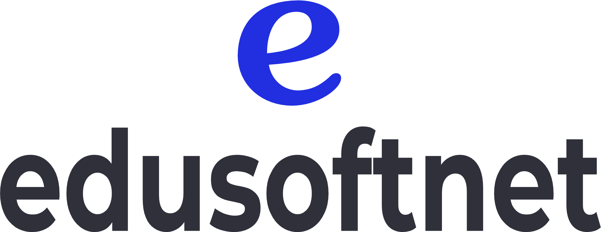
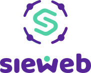
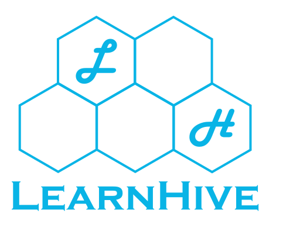

# Universidad Peruana de Ciencias Aplicadas

### **CURSO:** Fundamentos de Arquitectura de Software

### **NRC**: 6342

### **Profesor:** Abel Nehemias Rosales Caururu

### **Ingeniería de software**

## Informe de Trabajo Final

### **Nombre del startup:** APX-4

### **Nombre del producto:** LearnHive

## **Integrantes**

| **Nombre**                                | **Código** |
|-------------------------------------------|------------|
| **Alejo Cardenas, Jose Antonio**             | U202122484 |
| **Real Calderon, Sebastian Omar**       | U20221D964 |
| **Luquillas Asto, Omar** | U20211G641 |
| **Olivera Barzola, Eric Marlon**          | U202315032  |
| **Aliaga Urbina, Wilder Gonzalo**            | U202222001 |

**Septiembre 2025**

## Registro de Versiones del Informe

<table>
  <thead>
    <tr>
      <th>Versión</th>
      <th>Fecha</th>
      <th>Autor</th>
      <th>Descripción de modificación</th>
    </tr>
  </thead>
  <tbody>
    <tr>
      <td>0.1</td>
      <td>03/09/25</td>
      <td>Jose Alejo</td>
      <td>Elaboración de plantilla del reporte</td>
    </tr>
  </tbody>
</table>

# Contenido  

- [Student Outcome](#student-outcome) → Ver anexo A al final de este documento  

- [Capítulo I: Introducción](#capítulo-i-introducción)  
  - [1.1 Startup Profile](#11-startup-profile)  
    - [1.1.1 Descripción de la Startup](#111-descripción-de-la-startup)  
    - [1.1.2 Perfiles de integrantes del equipo](#112-perfiles-de-integrantes-del-equipo)  
  - [1.2 Solution Profile](#12-solution-profile)  
    - [1.2.1 Nombre del producto](#121-nombre-del-producto)  
    - [1.2.2 Antecedentes y problemática](#122-antecedentes-y-problemática)  
    - [1.2.3 Lean UX Process](#123-lean-ux-process)  
      - [1.2.3.1 Lean UX Problem Statement](#1231-lean-ux-problem-statement)  
      - [1.2.3.2 Lean UX Assumptions](#1232-lean-ux-assumptions)  
      - [1.2.3.3 Lean UX Hypothesis](#1233-lean-ux-hypothesis)  
      - [1.2.3.4 Lean UX Canvas](#1234-lean-ux-canvas)  
  - [1.3 Segmentos objetivo](#13-segmentos-objetivo)  

- [Capítulo II: Requirements & Analysis](#capítulo-ii-requirements--analysis)  
  - [2.1 Competidores](#21-competidores)  
  - [2.2 Entrevistas](#22-entrevistas)  
  - [2.3 Needfinding](#23-needfinding)  
    - [2.3.1 User Personas](#231-user-personas)  
    - [2.3.2 User Task Matrix](#232-user-task-matrix)  
    - [2.3.3 Empathy Maps](#233-empathy-maps)  
    - [2.3.4 As-is Scenario Mapping](#234-as-is-scenario-mapping)  

- [Capítulo III: Requirements Specification](#capítulo-iii-requirements-specification)  
  - [3.1 To-Be Scenario Mapping](#31-to-be-scenario-mapping)  
  - [3.2 User Stories](#32-user-stories)  
  - [3.3 Impact Map](#33-impact-map)  
  - [3.4 Product Backlog (Avance1)](#34-product-backlog-avance1)  

- [Capítulo IV: Product Architecture Design](#capítulo-iv-product-architecture-design)  
  - [4.1 Design Concepts, ViewPoints & ER Diagrams](#41-design-concepts-viewpoints--er-diagrams)  
    - [4.1.1 Principles Statements](#411-principles-statements)  
    - [4.1.2 Approaches Statements Architectural Styles & Patterns](#412-approaches-statements-architectural-styles--patterns)  
    - [4.1.3 Context Diagram](#413-context-diagram)  
    - [4.1.4 Approach driven ViewPoints Diagrams](#414-approach-driven-viewpoints-diagrams)  
    - [4.1.5 Relational/Non Relational Database Diagram](#415-relationalnon-relational-database-diagram)  
    - [4.1.6 Design Patterns](#416-design-patterns)  
    - [4.1.7 Tactics](#417-tactics)  
  - [4.2 Architectural Drivers](#42-architectural-drivers)  
    - [4.2.1 Design Purpose](#421-design-purpose)  
    - [4.2.2 Primary Functionality (Primary User Stories)](#422-primary-functionality-primary-user-stories)  
    - [4.2.3 Quality Attribute Scenarios](#423-quality-attribute-scenarios)  
    - [4.2.4 Constraints](#424-constraints)  
    - [4.2.5 Architectural Concerns](#425-architectural-concerns)  
  - [4.3 ADD Iterations](#43-add-iterations)  
    - [4.3.X Iteration N: <Iteration Name>](#43x-iteration-n-iteration-name)  
      - [4.3.X.1 Architectural Design Backlog N](#43x1-architectural-design-backlog-n)  
      - [4.3.X.2 Establish Iteration Goal by Selecting Drivers](#43x2-establish-iteration-goal-by-selecting-drivers)  
      - [4.3.X.3 Choose Elements to Refine](#43x3-choose-elements-to-refine)  
      - [4.3.X.4 Choose Design Concepts That Satisfy Drivers](#43x4-choose-design-concepts-that-satisfy-drivers)  
      - [4.3.X.5 Instantiate Elements, Allocate Responsibilities & Define Interfaces](#43x5-instantiate-elements-allocate-responsibilities--define-interfaces)  
      - [4.3.X.6 Sketch Views (C4 & UML) and Record Design Decisions](#43x6-sketch-views-c4--uml-and-record-design-decisions)  
      - [4.3.X.7 Analysis & Review (Kanban Board) (Avance 2)](#43x7-analysis--review-kanban-board-avance-2)  

- [Capítulo V: Product Implementation, Validation & Deployment](#capítulo-v-product-implementation-validation--deployment)  
  - [5.1 Testing Suites & General Patterns](#51-testing-suites--general-patterns)  
    - [5.1.1 Backend Application Core Testing Suite](#511-backend-application-core-testing-suite)  
    - [5.1.2 Pattern Based Backend Application(s)](#512-pattern-based-backend-applications)  
    - [5.1.3 Pattern Based Custom Software Library](#513-pattern-based-custom-software-library)  
    - [5.1.4 Framework Pattern Driven Refactoring Report](#514-framework-pattern-driven-refactoring-report)  
  - [5.2 Software Configuration Management](#52-software-configuration-management)  
    - [5.2.1 Software Development Environment Configuration](#521-software-development-environment-configuration)  
    - [5.2.2 Source Code Management](#522-source-code-management)  
    - [5.2.3 Source Code Style Guide & Conventions](#523-source-code-style-guide--conventions)  
    - [5.2.4 Software Deployment Configuration](#524-software-deployment-configuration)  
  - [5.3 Microservices Implementation](#53-microservices-implementation)  
    - [Sprint 1 (TP1)](#sprint-1-tp1)  
    - [Sprint 2 (Avance 3)](#sprint-2-avance-3)  
    - [Sprint 3 (Avance 4)](#sprint-3-avance-4)  
    - [Sprint 4](#sprint-4)  
  - [5.4 Microservices Deployment](#54-microservices-deployment)  
    - [5.4.1 Cloud Architecture Diagram](#541-cloud-architecture-diagram)  
    - [5.4.2 Cloud Architecture Deployment (AWS, Azure o GCP)](#542-cloud-architecture-deployment-aws-azure-o-gcp)  

- [Conclusiones](#conclusiones)  
  - [Conclusiones y recomendaciones](#conclusiones-y-recomendaciones)  
  - [Video About-The-Team](#video-about-the-team)  

- [Referencias Bibliográficas](#referencias-bibliográficas)  

- [Anexos](#anexos)  
  
- [Links](#links)  

# Student Outcome

| Criterio específico | Acciones realizadas | Conclusiones |
|----------------------|---------------------|--------------|
| **Actualiza conceptos y conocimientos necesarios para su desarrollo profesional y en especial para su proyecto en soluciones de software.** | **Alejo Cardenas, Jose Antonio** TB1: AAA… TB2: BBB… **Real Calderon, Sebastian Omar** TB1: AAA… **Luquillas Asto, Omar** TB1: AAA…  **Olivera Barzola, Eric Marlon** TB1: AAA…  **Aliaga Urbina, Wilder Gonzalo** TB1: AAA…  | AAA… |
| **Reconoce la necesidad del aprendizaje permanente para el desempeño profesional y el desarrollo de proyectos en soluciones de software.** | **Alejo Cardenas, Jose Antonio** TB1: BBB… TB2: BBB… **Real Calderon, Sebastian Omar** TB1: BBB… **Luquillas Asto, Omar** TB1: BBB…  **Olivera Barzola, Eric Marlon** TB1: BBB…  **Aliaga Urbina, Wilder Gonzalo** TB1: BBB…  | BBB... |

# Capítulo I: Introducción

## 1.1 Startup Profile
### 1.1.1 Descripción de la Startup
APX-4 es una startup iniciada por estudiantes de la Universidad Peruana de Ciencias Aplicadas con el objetivo de desarrollar soluciones tecnológicas para el ámbito educativo del Perú. Con nuestro producto principal, LearnHive, queremos ofrecer una alternativa de entorno digital para institutos académicos que no cuentan con una plataforma propia, ofreciéndoles las herramientas para el desarrollo de sus actividades de forma rápida, fácil y segura.

### 1.1.2 Perfiles de integrantes del equipo

## 1.2 Solution Profile
### 1.2.1 Nombre del producto
### 1.2.2 Antecedentes y problemática
### 1.2.3 Lean UX Process
#### 1.2.3.1 Lean UX Problem Statement
#### 1.2.3.2 Lean UX Assumptions
#### 1.2.3.3 Lean UX Hypothesis
#### 1.2.3.4 Lean UX Canvas

## 1.3 Segmentos objetivo

# Capítulo II: Requirements & Analysis

## 2.1 Competidores

- Sistema Saberes 

 

 

 

 

Sistema Saberes se posiciona como una solución integral de gestión educativa desarrollada localmente para el mercado peruano. Su plataforma abarca todos los procesos operativos de institutos superiores, centros de formación técnica y escuelas de negocios, desde la admisión y matrícula hasta la graduación y certificación. Está construido para cumplir con las normativas del Ministerio de Educación (MINEDU) y los requisitos de SUNEDU, offering módulos especializados en control académico (calificaciones, asistencias, horarios), gestión financiera (pensiones, cobranza) y comunicación institucional. Incluye herramientas de reportes básicos que permiten extraer datos históricos, pero su fortaleza radica en la centralización de la información administrativa más que en el análisis pedagógico profundo. 

 

 

- EduSoftNet 

 

 

 

EduSoft es un software modular de gestión educativa que ofrece soluciones escalables para colegios, institutos y academias en Perú. Su propuesta de valor se centra en la flexibilidad, allowing a las instituciones contratar solo los módulos que necesiten, como control académico, gestión financiera o library management. La plataforma genera reportes gerenciales predefinidos que ayudan en la toma de decisiones administrativas, pero su capacidad de análisis de datos pedagógicos es limitada. Está diseñado para instituciones que priorizan la optimización de procesos operativos por sobre la innovación en la enseñanza basada en datos. 

 

 

- SieWeb 

 

 

 

SieWeb es un sistema integral de gestión diseñado para instituciones de educación superior en Perú, including institutos tecnológicos y escuelas de posgrado. Su plataforma es altamente customizable, permitiendo adaptarse a flujos de trabajo específicos y mallas curriculares complejas. Ofrece módulos para la gestión del ciclo de vida del estudiante, prácticas preprofesionales, y generación de reportes personalizados para la alta dirección. Aunque incluye dashboards gerenciales, estos están orientados a métricas operativas y financieras, no al desempeño académico granular o a la intervención pedagógica temprana. SieWeb es ideal para instituciones que necesitan un ERP educativo a medida, pero no una herramienta ágil de análisis didáctico. 

### 2.1.1 Análisis Competitivo 

<table border="1" cellspacing="0" cellpadding="6">
  <tr>
    <th colspan="6"> Competitive Analysis Landscape </th>
  </tr>
  <tr>
    <td colspan="2" rowspan="2"> ¿Por qué llevar a cabo este análisis? </td>
    <td colspan="4"> Pregunta </td>
  </tr>
  <tr>
    <td colspan="4"> Este análisis se realiza para entender cómo se posiciona nuestro proyecto frente a competidores consolidados, identificar fortalezas y debilidades propias, descubrir oportunidades de diferenciación en el mercado de IoT para motocicletas y anticipar amenazas que puedan afectar la adopción del producto. </td>
  </tr>
  <tr>
    <td colspan="2"> Productos </td>
    <td style="text-align: center;"> 
LearnHive
  </td>
    <td style="text-align: center;"> 
Sistema Saberes
  </td>
    <td style="text-align: center;"> 
EduSoftNet
  </td>
    <td style="text-align: center;"> 
SieWeb
  </td>
  </tr>
  <tr>
    <td rowspan="2">Perfil</td>
    <td>Overview</td>
    <td>Plataforma especializada en analytics y gestión del desempeño académico.</td>
    <td>ERP educativo integral (gestión administrativa y académica).</td>
    <td>Software modular de gestión educativa (académica y financiera).</td>
    <td>Sistema customizable para educación superior (énfasis en procesos complejos).</td>
  </tr>
  <tr>
    <td>Ventaja competitiva (¿Qué valor ofrece a los clientes?)</td>
    <td>Dashboards, alertas tempranas, intervención proactiva y portal estudiantil.</td>
    <td>Cumplimiento normativo integrado (MINEDU/SUNEDU) y comunicación centralizada.</td>
    <td>Precios accesibles, módulos escalables y gestión financiera robusta.</td>
    <td>Adaptación total a flujos complejos (prácticas, titulación) y reportes personalizados.</td>
  </tr>
  <tr>
    <td rowspan="2">Perfil de Marketing</td>
    <td>Mercado Objetivo</td>
    <td>Institutos técnicos/superiores en Lima que priorizan la mejora pedagógica y ya tienen un sistema base.</td>
    <td>Institutos peruanos que buscan un ERP integral para automatizar procesos administrativos y académicos.</td>
    <td>Institutos y colegios con budgets ajustados que necesitan módulos específicos.</td>
    <td>Institutos con modelos educativos únicos o procesos complejos (ej: escuelas de posgrado).</td>
  </tr>
  <tr>
    <td>Estrategias de Marketing</td>
    <td>Marketing de contenidos (blog, webinars), demostraciones personalizadas, alianzas con asociaciones educativas.</td>
    <td>Ventas directas, referencias boca a boca, participación en ferias educativas.</td>
    <td>Precios competitivos, demostraciones gratuitas, enfoque en flexibilidad.</td>
    <td>Enfoque en customización, ventas B2B, casos de estudio con clientes grandes.</td>
  </tr>
  <tr>
    <td rowspan="3">Perfil de Producto</td>
    <td>Productos & Servicios</td>
    <td>Plataforma de analytics, dashboards interactivos, alertas tempranas, portal de estudiantes, soporte técnico.</td>
    <td>ERP educativo (admisión, matrícula, calificaciones, financiero), reportes básicos, soporte.</td>
    <td>Módulos de gestión académica, financiera, library, reportes predefinidos, soporte.</td>
    <td>ERP customizable, gestión de prácticas, titulación, dashboards gerenciales, soporte técnico.</td>
  </tr>
  <tr>
    <td>Precios & Costos</td>
    <td>Suscripción mensual por usuario (asequible). Bajo costo de implementación.</td>
    <td>Licencia anual costosa. Alta inversión inicial e implementación.</td>
    <td>Precios por módulo (accesible). Costo de implementación medio.</td>
    <td>Precios altos por customización. Implementación larga y costosa.</td>
  </tr>
  <tr>
    <td>Canales de distribución</td>
    <td>Ventas online, canal directo (equipo comercial), partners estratégicos.</td>
    <td>Ventas directas, canal telefónico, sitio web.</td>
    <td>Ventas directas, sitio web, redes sociales.</td>
    <td>Ventas B2B, consultores educativos, canal directo.</td>
  </tr>
  <tr>
    <td rowspan="4">Análisis SWOT</td>
    <td>Fortalezas</td>
    <td>Especialización en analytics, usabilidad, implementación rápida, precio accesible.</td>
    <td>Conocimiento normativo peruano, solución integral, presencia en el mercado.</td>
    <td>Precios flexibles, modularidad, experiencia en el mercado.</td>
    <td>Customización, manejo de procesos complejos, clientes grandes.</td>
  </tr>
  <tr>
    <td>Debilidades</td>
    <td>Dependencia de integración con otros sistemas, marca desconocida.</td>
    <td>Interface menos intuitiva, analytics limitados, alto costo.</td>
    <td>Analytics básicos, diseño no moderno, enfoque administrativo.</td>
    <td>Precio muy alto, implementación lenta, no es ágil para docentes.</td>
  </tr>
  <tr>
    <td>Oportunidades</td>
    <td>Creciente demanda de edtech, aliarse con competidores como complemento, expansión a otras ciudades.</td>
    <td>Cross-selling a clientes existentes, mejorar módulos de analytics.</td>
    <td>Upselling de módulos, integración con herramientas de analytics.</td>
    <td>Vender módulos de analytics como add-on, asociarse con consultoras.</td>
  </tr>
  <tr>
    <td>Amenazas</td>
    <td>Competidores agreguen analytics, resistencia al cambio en docentes, entrada de competidores globales.</td>
    <td>Saturación del mercado de ERPs.</td>
    <td>Competidores con precios más agresivos, avance de soluciones en la nube.</td>
    <td>Aversión a altos costos post-pandemia, competidores con soluciones más ágiles.</td>
  </tr>
</table>

### 2.1.2 Estrategias y tácticas frente a competidores 

#### Estrategia contra Sistema Saberes

- Estrategia: Especialización Académica y Agilidad de Implementación. 

  - Posicionar a LearnHive como la solución que eleva la gestión académica con analítica avanzada, detección temprana de riesgos y mejora del desempeño, destacando rapidez y facilidad en la adopción. 

- Tácticas: 

  - Implementación Rápida y Guiada : Ofrecer un proceso express de despliegue con acompañamiento técnico para que las instituciones puedan empezar a usar dashboards y reportes académicos en pocas semanas. 

  - Herramientas de Analítica Independiente: Proveer un módulo de importación de datos sencillo (Excel, CSV, Google Sheets), que permite a las instituciones aprovechar LearnHive sin necesidad de procesos complejos. 

  - Casos de Éxito Académicos : Publicar resultados concretos de clientes: reducción de deserción, mejora en el rendimiento académico, aumento en la satisfacción de los estudiantes.  

  - Campañas de Valor Educativo: Marketing de contenidos enfocado en la promesa: “De datos a decisiones académicas”. Artículos, webinars y guías prácticas para directores y coordinadores académicos. 

  - Modelo de Precios Escalable: Planes accesibles por institución o por número de estudiantes, con una entrada de bajo costo y beneficios claros en términos de retorno académico. 

  - Implementación Rápida y Guiada : Ofrecer un proceso express de despliegue con acompañamiento técnico para que las instituciones puedan empezar a usar dashboards y reportes académicos en pocas semanas. 

  - Herramientas de Analítica Independiente: Proveer un módulo de importación de datos sencillo (Excel, CSV, Google Sheets), que permite a las instituciones aprovechar LearnHive sin necesidad de procesos complejos. 

  - Casos de Éxito Académicos : Publicar resultados concretos de clientes: reducción de deserción, mejora en el rendimiento académico, aumento en la satisfacción de los estudiantes.  

  - Campañas de Valor Educativo: Marketing de contenidos enfocado en la promesa: “De datos a decisiones académicas”. Artículos, webinars y guías prácticas para directores y coordinadores académicos. 

  - Modelo de Precios Escalable: Planes accesibles por institución o por número de estudiantes, con una entrada de bajo costo y beneficios claros en términos de retorno académico.

#### Estrategia contra EduSoft (El Competidor Modular y Accesible) 

- Estrategia: Superioridad en Valor y Enfoque. 

  - Destacar que la "flexibilidad" de EduSoft sigue siendo administrativa, mientras que LearnHive ofrece un valor cualitativamente superior: la mejora de los resultados de aprendizaje. 

- Tácticas: 

  - Comparativa de Valor (Value Comparison): Desarrollar una comparativa sutil (para uso interno del equipo de ventas) que muestre cómo LearnHive, por un precio similar o ligeramente superior a un módulo de EduSoft, ofrece un retorno de la inversión (ROI) mucho mayor al impactar directamente en la retención y el éxito estudiantil. 

  - Enfoque en el "Dolor" del Profesor: Mientras EduSoft se vende a la administración, LearnHive debe marketing directo a los docentes. Talleres y webinars gratuitos sobre "Pedagogía Data-Driven" para crear demanda desde abajo hacia arriba. El profesor convencido será el mejor aliado interno. 

  - Prueba Gratuita Irresistible: Ofrecer una prueba de 30 días con data de demostración rica e insights inmediatos. Contrastar con la posible complejidad y tiempo que lleva configurar los módulos de EduSoft. 

  - Case Studies con Énfasis en Resultados: Documentar y promocionar casos de éxito con métricas concretas: "Con LearnHive, el Instituto XYZ identificó al 20% de su población en riesgo y logró recuperar al 15% gracias a intervenciones tempranas." EduSoft muestra funcionalidades; LearnHive debe mostrar resultados. 

#### Estrategia contra SieWeb (El Competidor Personalizable y Complejo) 

- Estrategia: Agilidad y Simplicidad. 

  - Posicionar a SieWeb como una solución "pesada", "lenta" y "costosa" para la necesidad específica de analytics. LearnHive es la alternativa "ágil", "moderna" y "centrada en el usuario". 

- Tácticas: 

  - Messaging de "Time-to-Value": Crear mensajes contundentes: "¿6 meses para un dashboard? Con LearnHive, tiene insights valiosos en 6 días." o "La customización compleja vs. la inteligencia inmediata". Atacar su punto más débil: la velocidad. 

  - Precio Predecible vs. Costo Variable: Enfatizar el modelo de suscripción simple y predecible de LearnHive vs. los costos impredecibles de customización y consultoría de SieWeb. Apelar al budget controlado de los institutos. 

  - Show, Don't Tell: Utilizar demostraciones en vivo para mostrar la intuitividad de LearnHive. Pedirle al cliente que imagine tener que solicitar cada nuevo reporte o cambio a un consultor de SieWeb vs. obtenerlo ellos mismos con clics. 

  - Target en los Decisores de Línea Media: SieWeb se vende a la alta dirección. LearnHive debe hablarle al Jefe de Programa, al Coordinador Académico, al responsable de calidad educativa, que son quienes sufren la falta de agilidad y necesitan datos rápidos para su trabajo diario. 

## 2.2 Entrevistas
### 2.2.1 Diseño de entrevistas

#### Segmento Objetivo 1: Estudiantes de Institutos 

Preguntas principales 

1. ¿Podrías contar un poco sobre ti? (edad, carrera, lugar de residencia, ocupación). 

2. ¿Cómo sueles organizar tus tareas y trabajos en grupo durante el ciclo académico? 

3. ¿Qué plataformas o aplicaciones usas más para estudiar o coordinar trabajos en grupo? (por ejemplo: WhatsApp, Meet, etc). 

4. ¿Te resulta sencillo mantener un orden entre tareas y comunicaciones? ¿Por qué sí o por qué no? 

5. ¿Qué te daría más confianza en una plataforma académica: facilidad de uso, notificaciones, métricas de avance u otra cosa? 

6. ¿Qué tan importante es para ti recibir una retroalimentación rápida sobre tus entregas o calificaciones? 

Preguntas complementarias 

1. ¿Usas más tu celular, laptop o tablet cuando estudias? ¿Por qué? 

2. ¿Qué experiencias positivas o negativas has tenido usando plataformas como Moodle, Canvas o Classroom? 

3. ¿En qué casos te ha resultado difícil organizarte o cumplir con tus entregas a tiempo? 

4. ¿Qué tan valioso sería para ti poder ver tu progreso académico en gráficos o estadísticas simples? 

5. ¿Te frustra depender de varias aplicaciones distintas para tu desempeño académico?

#### Segmento Objetivo 2: Profesores de Institutos 

Preguntas principales 

1. Para comenzar, ¿podría contarme un poco sobre usted? (edad, distrito de residencia, área de enseñanza). 

2. ¿Qué herramientas utiliza actualmente para planificar, compartir materiales y gestionar tareas con sus estudiantes? 

3. ¿Qué parte de su trabajo fuera del aula le consume más tiempo (revisar entregas, calificar, dar seguimiento a alumnos, etc.)? 

4. ¿Cómo realiza actualmente el seguimiento del desempeño de sus estudiantes? 

5. Si pudiera elegir, ¿qué funcionalidad sería la más valiosa en una plataforma académica: centralización de tareas, estadísticas, comunicación o retroalimentación automatizada? 

6. ¿Qué tan cómodo se sentiría con una plataforma que genere métricas claras y fáciles de entender sobre el progreso de cada estudiante? 

  

Preguntas complementarias 

1. ¿Qué dispositivo utiliza más a menudo para trabajar: laptop, PC o smartphone? 

2. ¿Qué medios emplea para comunicarse con sus estudiantes (WhatsApp, correo, etc)? ¿Qué ventajas o problemas encuentra en ellos? 

3. ¿Ha usado antes plataformas educativas? ¿Qué le funcionó bien y qué le resultó poco práctico? 

4. ¿Qué tipo de actividades digitales o interactivas le gustaría integrar en sus clases pero hoy le resulta difícil hacerlo? 

5. ¿Qué tan difícil considera la curva de aprendizaje de nuevas plataformas educativas? 

### 2.2.2 Registro de entrevistas

## Profesores de instituto:

# Entrevista 1: Profesor de Instituto

| Campo                           | Detalle                                                                                                                                                                                                                                                                                                                                                                                                            |
|---------------------------------|--------------------------------------------------------------------------------------------------------------------------------------------------------------------------------------------------------------------------------------------------------------------------------------------------------------------------------------------------------------------------------------------------------------------|
| **Foto y link**                 |     https://upcedupe-my.sharepoint.com/:v:/g/personal/u202222001_upc_edu_pe/Ebm3vVNNWp5LhPvEdzPqrOoBFcxHE-lethU07o73kYOcLw?nav=eyJyZWZlcnJhbEluZm8iOnsicmVmZXJyYWxBcHAiOiJTdHJlYW1XZWJBcHAiLCJyZWZlcnJhbFZpZXciOiJTaGFyZURpYWxvZy1MaW5rIiwicmVmZXJyYWxBcHBQbGF0Zm9ybSI6IldlYiIsInJlZmVycmFsTW9kZSI6InZpZXcifX0%3D&e=1gXjE8 |
| **Nombre Entrevistado**         | Wilder Aliaga Linares                                                                                                                                                                                                                                                                                                                                                                                              |
| **Edad**                        | 49 años                                                                                                                                                                                                                                                                                                                                                                                                            |
| **Profesión**                   | Profesor universitario / docente de institutos                                                                                                                                                                                                                                                                                                                                                                     |
| **Ubicación**                   | Lima, Perú                                                                                                                                                                                                                                                                                                                                                                                                         |
| **Duración de la Entrevista**   | 11:15 min                                                                                                                                                                                                                                                                                                                                                                                                          |
| **Herramientas actuales**       | Plataformas institucionales, WhatsApp para grupos y comunicación, Excel y Dropbox para notas y materiales.                                                                                                                                                                                                                                                                                                         |
| **Dolores principales**         | La calificación manual consume mucho tiempo; también la subida de notas y actualización de materiales.                                                                                                                                                                                                                                                                                                             |
| **Seguimiento del desempeño**   | Uso de Excel de manera manual y carga posterior en plataformas; considera el proceso lento y poco automatizado.                                                                                                                                                                                                                                                                                                    |
| **Necesidades prioritarias**    | Retroalimentación automatizada, estadísticas en tiempo real y una plataforma más flexible y amigable.                                                                                                                                                                                                                                                                                                              |
| **Dispositivos y comunicación** | Usa laptop y celular; se comunica sobre todo por WhatsApp (ventajas: rapidez y cercanía; desventajas: superficialidad y poca profundidad académica).                                                                                                                                                                                                                                                               |
| **Experiencia con plataformas** | Ha usado varias, pero las considera manuales, inestables y con soporte técnico deficiente**.                                                                                                                                                                                                                                                                                                                       |
| **Interactividad deseada**      | Más videos cortos, materiales lúdicos e interactividad en tiempo real; las herramientas actuales le parecen obsoletas.                                                                                                                                                                                                                                                                                             |
| **Curva de aprendizaje**        | Considera que las plataformas suelen ser complejas y no se adaptan a todos los estudiantes; plantea integrar IA como asistente 24/7 para retroalimentación continua.                                                                                                                                                                                                                                               |

## Estudiantes de instituto:

# Entrevista 4: Estudiante de Instituto

| Campo                           | Detalle                                                                                                                                                                                                                                                                                                                                                                                                            |
|---------------------------------|--------------------------------------------------------------------------------------------------------------------------------------------------------------------------------------------------------------------------------------------------------------------------------------------------------------------------------------------------------------------------------------------------------------------|
| **Foto y link**                 |     [Entrevista David](https://upcedupe-my.sharepoint.com/:v:/g/personal/u202122484_upc_edu_pe/EVTknz75o7JKkpZAnEMecPYBo8g7YDPVxY6T6qXIHJBvcg?nav=eyJyZWZlcnJhbEluZm8iOnsicmVmZXJyYWxBcHAiOiJPbmVEcml2ZUZvckJ1c2luZXNzIiwicmVmZXJyYWxBcHBQbGF0Zm9ybSI6IldlYiIsInJlZmVycmFsTW9kZSI6InZpZXciLCJyZWZlcnJhbFZpZXciOiJNeUZpbGVzTGlua0NvcHkifX0&e=hi1ak8) |
| **Nombre Entrevistado**         | David Manuel Torres Meneses                                                                                                                                                                                                                                                                                                                                                                                              |
| **Edad**                        | 19 años                                                                                                                                                                                                                                                                                                                                                                                                            |
| **Profesión**                   | Estudiante universitario / estudiante de instituto                                                                                                                                                                                                                                                                                                                                                                     |
| **Ubicación**                   | Lima, Perú                                                                                                                                                                                                                                                                                                                                                                                                         |
| **Duración de la Entrevista**   | 11:38 min                                                                                                                                                                                                                                                                                                                                                                                                          |
| **Herramientas actuales**       | Plataformas institucionales, WhatsApp para grupos y comunicación, Meet, Discord, Excel y Classroom para notas y materiales.                                                                                                                                                                                                                                                                                                         |
| **Dolores principales**         | La falta de graficas que permitan evidenciar su desarrollo como estudiante no le permite saber que tan bien se esta desarrollando como estudiante.                                                                                                                                                                                                                                                                                                             |
| **Seguimiento del desempeño**   | Usa un excel para poder hacer su organizacion y calculo de notas durante el desarrollo del ciclo.                                                                                                                                                                                                                                                                                                    |
| **Necesidades prioritarias**    | Retroalimentación instantanea, estadísticas de sus notas y graficos que permitan comparar su avance.                                                                                                                                                                                                                                                                                                              |
| **Dispositivos y comunicación** | Usa mucho mas su celular que la laptop; pero prefiere usar la laptop ya que tiene un alcance mas largo deacuerdo a posibilidades.                                                                                                                                                                                                                                                               |
| **Experiencia con plataformas** | Ha usado principalmente Classroom pero considera que tiene una ventaja para compartir archivos sin embargo al no tener un sistema de verificados hay otros usuarios que la usan sin responsabilidad.                                                                                                                                                                                                                                                                                                                       |
| **Interactividad deseada**      | Mas graficas, estadisticas, feedbacks o un dashboard que permita unir todos estos ambitos y poder analizar su desempeño.                                                                                                                                                                                                                                                                                             |
| **Curva de aprendizaje**        | Considera que las plataformas suelen ser poco intuitivas y los estudiantes nunca pueden sacarle todo el provecho.                                                                                                                                                                                                                                               |

### 2.2.3 Analisis de entrevistas
## 2.3 Needfinding
### 2.3.1 User Personas
### 2.3.2 User Task Matrix
### 2.3.3 Empathy Maps
### 2.3.4 As-is Scenario Mapping

# Capítulo III: Requirements Specification

## 3.1 To-Be Scenario Mapping
## 3.2 User Stories
## 3.3 Impact Map
## 3.4 Product Backlog (Avance1)

# Capítulo IV: Product Architecture Design

## 4.1 Design Concepts, ViewPoints & ER Diagrams
### 4.1.1 Principles Statements
### 4.1.2 Approaches Statements Architectural Styles & Patterns
### 4.1.3 Context Diagram
### 4.1.4 Approach driven ViewPoints Diagrams
### 4.1.5 Relational/Non Relational Database Diagram
### 4.1.6 Design Patterns
### 4.1.7 Tactics

## 4.2 Architectural Drivers
### 4.2.1 Design Purpose
### 4.2.2 Primary Functionality (Primary User Stories)
### 4.2.3 Quality Attribute Scenarios
### 4.2.4 Constraints
### 4.2.5 Architectural Concerns

## 4.3 ADD Iterations
### 4.3.X Iteration N: <Iteration Name>
#### 4.3.X.1 Architectural Design Backlog N
#### 4.3.X.2 Establish Iteration Goal by Selecting Drivers
#### 4.3.X.3 Choose Elements to Refine
#### 4.3.X.4 Choose Design Concepts That Satisfy Drivers
#### 4.3.X.5 Instantiate Elements, Allocate Responsibilities & Define Interfaces
#### 4.3.X.6 Sketch Views (C4 & UML) and Record Design Decisions
#### 4.3.X.7 Analysis & Review (Kanban Board) (Avance 2)

# Capítulo V: Product Implementation, Validation & Deployment

## 5.1 Testing Suites & General Patterns
### 5.1.1 Backend Application Core Testing Suite
### 5.1.2 Pattern Based Backend Application(s)
### 5.1.3 Pattern Based Custom Software Library
### 5.1.4 Framework Pattern Driven Refactoring Report

## 5.2 Software Configuration Management
### 5.2.1 Software Development Environment Configuration
### 5.2.2 Source Code Management
### 5.2.3 Source Code Style Guide & Conventions
### 5.2.4 Software Deployment Configuration

## 5.3 Microservices Implementation

### Sprint 1 (TP1)
#### 5.3.1.1 Sprint Backlog 1
#### 5.3.1.2 Development Evidence for Sprint Review
#### 5.3.1.3 Testing Suite Evidence for Sprint Review
#### 5.3.1.4 Execution Evidence for Sprint Review
#### 5.3.1.5 Microservices Documentation Evidence for Sprint Review
#### 5.3.1.6 Software Deployment Evidence for Sprint Review
#### 5.3.1.7 Team Collaboration Insights during Sprint
#### 5.3.1.8 Kanban Board

### Sprint 2 (Avance 3)
#### 5.3.2.1 Sprint Backlog 2
#### 5.3.2.2 Development Evidence for Sprint Review
#### 5.3.2.3 Testing Suite Evidence for Sprint Review
#### 5.3.2.4 Execution Evidence for Sprint Review
#### 5.3.2.5 Microservices Documentation Evidence for Sprint Review
#### 5.3.2.6 Software Deployment Evidence for Sprint Review
#### 5.3.2.7 Team Collaboration Insights during Sprint
#### 5.3.2.8 Kanban Board

### Sprint 3 (Avance 4)
#### 5.3.3.1 Sprint Backlog 3
#### 5.3.3.2 Development Evidence for Sprint Review
#### 5.3.3.3 Testing Suite Evidence for Sprint Review
#### 5.3.3.4 Execution Evidence for Sprint Review
#### 5.3.3.5 Microservices Documentation Evidence for Sprint Review
#### 5.3.3.6 Software Deployment Evidence for Sprint Review
#### 5.3.3.7 Team Collaboration Insights during Sprint
#### 5.3.3.8 Kanban Board

### Sprint 4
#### 5.3.4.1 Sprint Backlog 4
#### 5.3.4.2 Development Evidence for Sprint Review
#### 5.3.4.3 Testing Suite Evidence for Sprint Review
#### 5.3.4.4 Execution Evidence for Sprint Review
#### 5.3.4.5 Microservices Documentation Evidence for Sprint Review
#### 5.3.4.6 Software Deployment Evidence for Sprint Review
#### 5.3.4.7 Team Collaboration Insights during Sprint
#### 5.3.4.8 Kanban Board

## 5.4 Microservices Deployment
### 5.4.1 Cloud Architecture Diagram
### 5.4.2 Cloud Architecture Deployment (AWS, Microsoft Azure o Google Cloud) → TF1

# Conclusiones
## Conclusiones y recomendaciones
## Video About-The-Team

# Referencias Bibliográficas

# Anexos
# Links
