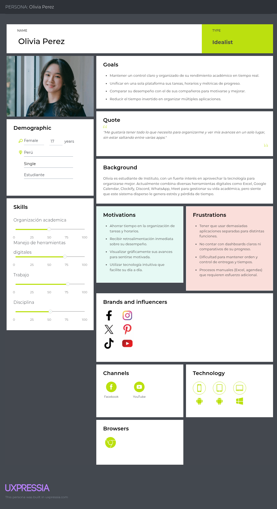

# Universidad Peruana de Ciencias Aplicadas

### **CURSO:** Fundamentos de Arquitectura de Software

### **NRC**: 6342

### **Profesor:** Abel Nehemias Rosales Caururu

### **Ingeniería de software**

## Informe de Trabajo Final

### **Nombre del startup:** APX-4

### **Nombre del producto:** LearnHive

## **Integrantes**

| **Nombre**                                | **Código** |
|-------------------------------------------|------------|
| **Alejo Cardenas, Jose Antonio**             | U202122484 |
| **Real Calderon, Sebastian Omar**       | U20221D964 |
| **Luquillas Asto, Omar** | U20211G641 |
| **Olivera Barzola, Eric Marlon**          | U202315032  |
| **Aliaga Urbina, Wilder Gonzalo**            | U202222001 |

**Septiembre 2025**

## Registro de Versiones del Informe

| Versión | Fecha       | Autor                                                                                   | Descripción de modificación                                                                                                                                                       |
|---------|------------|------------------------------------------------------------------------------------------|-----------------------------------------------------------------------------------------------------------------------------------------------------------------------------------|
| 0.1     | 09/09/2025 | Real Calderón Sebastián Omar y Alejo Cardenas Jose Antonio                                | Desarrollo de los ítems: 1.1.1 Descripción de la Startup, 1.1.2 Perfiles de integrantes del equipo, 1.2.1 Nombre del producto                                                     |
| 0.2     | 10/09/2025 | Real Calderón Sebastián Omar, Olivera Barzola Eric Marlon y Luquillas Asto Omar           | Desarrollo de los ítems: 1.2.2 Antecedentes y problemática, 1.2.3.1 Lean UX Problem Statement, 1.2.3.2 Lean UX Assumptions, 1.2.3.3 Lean UX Hypothesis, 1.2.3.4 Lean UX Canvas y 1.3 Segmentos objetivo |
| 0.3     | 11/09/2025 | Alejo Cardenas Jose Antonio, Aliaga Urbina Wilder Gonzalo y Olivera Barzola Eric Marlon   | Desarrollo de los ítems: 2.1 Competidores, 2.2 Entrevistas, 2.3.1 User Personas, 2.3.2 User Task Matrix, 2.3.3 Empathy Maps y 2.3.4 As-is Scenario Mapping                        |
| 0.4     | 12/09/2025 | Luquillas Asto Omar, Aliaga Urbina Wilder Gonzalo y Real Calderón Sebastián Omar          | Desarrollo de los ítems: 3.1 To-Be Scenario Mapping, 3.2 User Stories, 3.3 Impact Map, 3.4 Product Backlog                                                                        |
| 1.0     | 13/09/2025 | Real Calderón Sebastián Omar y Alejo Cardenas Jose Antonio                                | Revisión completa hasta el capítulo 3, corrección ortográfica y coherencia global del reporte.                                                                                    |

# Contenido  

- [Student Outcome](#student-outcome) → Ver anexo A al final de este documento  

- [Capítulo I: Introducción](#capítulo-i-introducción)  
  - [1.1 Startup Profile](#11-startup-profile)  
    - [1.1.1 Descripción de la Startup](#111-descripción-de-la-startup)  
    - [1.1.2 Perfiles de integrantes del equipo](#112-perfiles-de-integrantes-del-equipo)  
  - [1.2 Solution Profile](#12-solution-profile)  
    - [1.2.1 Nombre del producto](#121-nombre-del-producto)  
    - [1.2.2 Antecedentes y problemática](#122-antecedentes-y-problemática)  
    - [1.2.3 Lean UX Process](#123-lean-ux-process)  
      - [1.2.3.1 Lean UX Problem Statement](#1231-lean-ux-problem-statement)  
      - [1.2.3.2 Lean UX Assumptions](#1232-lean-ux-assumptions)  
      - [1.2.3.3 Lean UX Hypothesis](#1233-lean-ux-hypothesis)  
      - [1.2.3.4 Lean UX Canvas](#1234-lean-ux-canvas)  
  - [1.3 Segmentos objetivo](#13-segmentos-objetivo)  

- [Capítulo II: Requirements & Analysis](#capítulo-ii-requirements--analysis)  
  - [2.1 Competidores](#21-competidores)  
  - [2.2 Entrevistas](#22-entrevistas)  
  - [2.3 Needfinding](#23-needfinding)  
    - [2.3.1 User Personas](#231-user-personas)  
    - [2.3.2 User Task Matrix](#232-user-task-matrix)  
    - [2.3.3 Empathy Maps](#233-empathy-maps)  
    - [2.3.4 As-is Scenario Mapping](#234-as-is-scenario-mapping)  

- [Capítulo III: Requirements Specification](#capítulo-iii-requirements-specification)  
  - [3.1 To-Be Scenario Mapping](#31-to-be-scenario-mapping)  
  - [3.2 User Stories](#32-user-stories)  
  - [3.3 Impact Map](#33-impact-map)  
  - [3.4 Product Backlog (Avance1)](#34-product-backlog-avance1)  

- [Capítulo IV: Product Architecture Design](#capítulo-iv-product-architecture-design)  
  - [4.1 Design Concepts, ViewPoints & ER Diagrams](#41-design-concepts-viewpoints--er-diagrams)  
    - [4.1.1 Principles Statements](#411-principles-statements)  
    - [4.1.2 Approaches Statements Architectural Styles & Patterns](#412-approaches-statements-architectural-styles--patterns)  
    - [4.1.3 Context Diagram](#413-context-diagram)  
    - [4.1.4 Approach driven ViewPoints Diagrams](#414-approach-driven-viewpoints-diagrams)  
    - [4.1.5 Relational/Non Relational Database Diagram](#415-relationalnon-relational-database-diagram)  
    - [4.1.6 Design Patterns](#416-design-patterns)  
    - [4.1.7 Tactics](#417-tactics)  
  - [4.2 Architectural Drivers](#42-architectural-drivers)  
    - [4.2.1 Design Purpose](#421-design-purpose)  
    - [4.2.2 Primary Functionality (Primary User Stories)](#422-primary-functionality-primary-user-stories)  
    - [4.2.3 Quality Attribute Scenarios](#423-quality-attribute-scenarios)  
    - [4.2.4 Constraints](#424-constraints)  
    - [4.2.5 Architectural Concerns](#425-architectural-concerns)  
  - [4.3 ADD Iterations](#43-add-iterations)  
    - [4.3.X Iteration N: <Iteration Name>](#43x-iteration-n-iteration-name)  
      - [4.3.X.1 Architectural Design Backlog N](#43x1-architectural-design-backlog-n)  
      - [4.3.X.2 Establish Iteration Goal by Selecting Drivers](#43x2-establish-iteration-goal-by-selecting-drivers)  
      - [4.3.X.3 Choose Elements to Refine](#43x3-choose-elements-to-refine)  
      - [4.3.X.4 Choose Design Concepts That Satisfy Drivers](#43x4-choose-design-concepts-that-satisfy-drivers)  
      - [4.3.X.5 Instantiate Elements, Allocate Responsibilities & Define Interfaces](#43x5-instantiate-elements-allocate-responsibilities--define-interfaces)  
      - [4.3.X.6 Sketch Views (C4 & UML) and Record Design Decisions](#43x6-sketch-views-c4--uml-and-record-design-decisions)  
      - [4.3.X.7 Analysis & Review (Kanban Board) (Avance 2)](#43x7-analysis--review-kanban-board-avance-2)  

- [Capítulo V: Product Implementation, Validation & Deployment](#capítulo-v-product-implementation-validation--deployment)  
  - [5.1 Testing Suites & General Patterns](#51-testing-suites--general-patterns)  
    - [5.1.1 Backend Application Core Testing Suite](#511-backend-application-core-testing-suite)  
    - [5.1.2 Pattern Based Backend Application(s)](#512-pattern-based-backend-applications)  
    - [5.1.3 Pattern Based Custom Software Library](#513-pattern-based-custom-software-library)  
    - [5.1.4 Framework Pattern Driven Refactoring Report](#514-framework-pattern-driven-refactoring-report)  
  - [5.2 Software Configuration Management](#52-software-configuration-management)  
    - [5.2.1 Software Development Environment Configuration](#521-software-development-environment-configuration)  
    - [5.2.2 Source Code Management](#522-source-code-management)  
    - [5.2.3 Source Code Style Guide & Conventions](#523-source-code-style-guide--conventions)  
    - [5.2.4 Software Deployment Configuration](#524-software-deployment-configuration)  
  - [5.3 Microservices Implementation](#53-microservices-implementation)  
    - [Sprint 1 (TP1)](#sprint-1-tp1)  
    - [Sprint 2 (Avance 3)](#sprint-2-avance-3)  
    - [Sprint 3 (Avance 4)](#sprint-3-avance-4)  
    - [Sprint 4](#sprint-4)  
  - [5.4 Microservices Deployment](#54-microservices-deployment)  
    - [5.4.1 Cloud Architecture Diagram](#541-cloud-architecture-diagram)  
    - [5.4.2 Cloud Architecture Deployment (AWS, Azure o GCP)](#542-cloud-architecture-deployment-aws-azure-o-gcp)  

- [Conclusiones](#conclusiones)  
  - [Conclusiones y recomendaciones](#conclusiones-y-recomendaciones)  
  - [Video About-The-Team](#video-about-the-team)  

- [Referencias Bibliográficas](#referencias-bibliográficas)  

- [Anexos](#anexos)  

# Student Outcome

| Criterio específico | Acciones realizadas | Conclusiones |
|----------------------|---------------------|--------------|
| Actualiza conceptos y conocimientos necesarios para su desarrollo profesional y en especial para su proyecto en soluciones de software. | TB1: **Alejo Cárdenas, José Antonio:** Al desarrollar la descripción de la startup, analicé el funcionamiento de nuestra propuesta y cómo se diferencia de otras. También revisé a los competidores para entender sus fortalezas y debilidades, lo cual me ayudó a actualizar mis conocimientos. Además, elaboré user stories y organicé el product backlog, aprendiendo nuevas formas de priorizar y ordenar tareas.  **Luquillas Asto, Omar:** Me encargué de los apartados de Lean UX. Al hacerlo, aprendí a formular problemas de manera más clara, a generar hipótesis y a trabajar con supuestos. Esto me permitió reforzar mis conocimientos sobre cómo validar ideas y centrarme más en los usuarios.  **Real Calderón, Sebastián Omar:** Redacté los antecedentes y la problemática del proyecto, lo que me ayudó a investigar y actualizarme sobre el contexto de la industria. También trabajé en la segmentación de usuarios y en los escenarios As-Is y To-Be, lo que me permitió aprender nuevas formas de representar situaciones actuales y proponer mejoras.  **Olivera Barzola, Eric Marlon:** Realicé entrevistas para entender mejor a los usuarios, lo cual me permitió practicar y aprender más sobre técnicas de investigación. Además, elaboré user personas, la matriz de tareas y mapas de empatía, aprendiendo cómo traducir la información obtenida en representaciones claras de los usuarios.  **Aliaga Urbina, Wilder Gonzalo:** Participé en entrevistas y desarrollé un impact map. Gracias a esto, reforcé mis conocimientos sobre cómo relacionar objetivos y necesidades, y comprendí mejor cómo estas herramientas ayudan a planificar un proyecto de manera más clara. | TB1: El equipo logró actualizar y aplicar de manera efectiva conceptos clave de gestión ágil, análisis estratégico y diseño centrado en el usuario. Cada integrante fortaleció sus conocimientos técnicos y metodológicos al abordar sus entregables, consolidando una base sólida para el desarrollo del proyecto de software. |
| Reconoce la necesidad del aprendizaje permanente para el desempeño profesional y el desarrollo de proyectos en soluciones de software. | TB1: **Alejo Cárdenas, José Antonio:** Al realizar el análisis de competidores y trabajar en el backlog, entendí que siempre es necesario seguir aprendiendo, porque las herramientas y metodologías cambian constantemente y hay que adaptarse.  **Luquillas Asto, Omar:** Al desarrollar el Lean UX, reconocí que el aprendizaje es un proceso continuo, ya que siempre surgen nuevas formas de validar ideas y mejorar la experiencia del usuario.  **Real Calderón, Sebastián Omar:** Trabajando en los escenarios As-Is y To-Be me di cuenta de que cada vez hay cambios en los usuarios y en la tecnología, por lo que es clave estar en constante aprendizaje para poder adaptarse.  **Olivera Barzola, Eric Marlon:** Al aplicar entrevistas y elaborar mapas de empatía, comprendí que siempre hay nuevas técnicas para investigar mejor a los usuarios y que es necesario seguir aprendiendo para mejorar los resultados.  **Aliaga Urbina, Wilder Gonzalo:** Con el impact map entendí que para alinear objetivos y necesidades hay que estar actualizado, lo que refuerza la importancia de aprender de manera continua. | TB1: El grupo reconoció que el aprendizaje permanente es fundamental en el ámbito del software, ya que permite adaptarse a nuevas metodologías, tecnologías y necesidades de los usuarios. La experiencia de este proyecto evidenció que la mejora continua es clave para la calidad del desarrollo y para su futuro desempeño profesional. |

# Capítulo I: Introducción

## 1.1 Startup Profile

### 1.1.1 Descripción de la Startup

APX-4 es una startup fundada por estudiantes de la Universidad Peruana de Ciencias Aplicadas (UPC), con la misión de revolucionar la educación en el Perú mediante soluciones tecnológicas accesibles y de alto impacto. 

Nuestro producto principal, LearnHive, es una plataforma integral de análisis y gestión educativa diseñada específicamente para los institutos de Lima Metropolitana que carecen de un sistema unificado. 

Para los profesores, ofrecemos un dashboard intuitivo que les permite supervisar el estado general de sus cursos en tiempo real. Esta visión integral les facilita el monitoreo continuo del progreso del aula, asegurando que siempre tengan una visión general del estado de su clase. 

Por otro lado, para los alumnos, proporcionamos un portal de acceso seguro donde pueden visualizar sus propias estadísticas y progreso académico de forma clara y transparente, así como acceder a herramientas que les permitan organizar mejor sus actividades y tiempo. Este acceso empodera a los estudiantes, dándoles mayor control sobre su educación. 

- Misión: Potenciar el éxito académico en los institutos de Lima Metropolitana mediante una plataforma de apoyo educativo intuitiva y poderosa. Brindamos a los educadores las herramientas para tomar decisiones proactivas e impactar positivamente en el aprendizaje de cada estudiante. 

- Visión: Ser la plataforma de gestión educativa de referencia en Lima Metropolitana, reconocida por transformar el ambiente académico para un mejor desempeño. elevando la calidad de la enseñanza y convirtiendo a los institutos en centros de innovación pedagógica. 
### 1.1.2 Perfiles de integrantes del equipo

<table>
  <tr>
    <th colspan="2"> Jose Antonio Alejo Cardenas </th>
  </tr>
  <tr>
    <td>  </td>
    <td>Soy José Alejo Cárdenas, estudiante de Ingeniería de Software en el séptimo ciclo en la UPC, perteneciente al décimo superior. Desde pequeño he sentido fascinación por la tecnología, en especial por el desarrollo, funcionamiento y seguridad del software. Tengo formación en lenguajes de programación como Java, JavaScript, Python y C++, así como en gestión de bases de datos (Microsoft SQL Server y MongoDB). Manejo entornos de desarrollo como IntelliJ IDEA Ultimate y experiencia en sistemas operativos (Windows y Kali Linux). También cuento con conocimientos en ensamblaje y mantenimiento de hardware, comprendiendo el funcionamiento técnico de los equipos. Me caracterizo por mi comunicación efectiva, organización y trabajo colaborativo, cualidades que aportan dinamismo y sinergia en proyectos grupales. Entre mis principales intereses se encuentran el desarrollo backend con Spring Boot, la ciberseguridad y la optimización de sistemas. En lo personal, disfruto de entrenar en el gimnasio, jugar videojuegos y compartir momentos con amigos. Para el proyecto, aportaré organización, comunicación e inspiración a lo largo de todo su desarrollo. </td>
  </tr>
  <tr>
    <th colspan="2"> Sebastián Omar Real Calderón </th>
  </tr>
  <tr>
    <td>  </td>
    <td> Soy Sebastián Real Calderón, estudiante de Ingeniería de Software. Tengo conocimiento de diferentes lenguajes de programación, como C#, C++ y Java. Mi mayor objetivo al desarrollar software es crear una experiencia de usuario con la que los consumidores puedan sentirse satisfechos al trabajar con nuestras aplicaciones. Asimismo, aspiro a ser un buen participante al mantener una comunicación constante con mis compañeros, resolviendo problemas y apoyando a quién lo necesite para crear un ambiente cómodo para todos.  </td>
  </tr>
  <tr>
    <th colspan="2"> Omar Luquillas Asto </th>
  </tr>
  <tr>
    <td>  </td>
    <td> Soy Omar Luquillas Asto, estudiante de la carrera de Ingeniería de Software. Elegí esta carrera porque me apasiona la tecnología, el desarrollo de software y la programación. Tengo conocimientos en lenguajes de programación como C++, Python y Java. Me considero una persona investigadora, ya que me gusta aprender cosas nuevas y siempre estoy en busca de soluciones creativas e innovadoras que generen un impacto positivo en la vida de las personas. Además, valoro el trabajo en equipo, soy responsable y me comprometo a cumplir con mis tareas de manera eficiente.  </td>
  </tr>
  <tr>
    <th colspan="2">Eric Marlon Olivera Barzola </th>
  </tr>
  <tr>
    <td>  </td>
    <td>Soy Eric Marlon Olivera Barzola, estudiante de Ingeniería de Software del séptimo ciclo, con un interés particular en la ciberseguridad. A lo largo de mi formación he adquirido experiencia en diferentes lenguajes de programación como C#, C++ y Java. Me motiva desarrollar soluciones que no solo sean funcionales, sino que también transmitan confianza y seguridad a los usuarios.  </td>
  </tr>
  <tr>
    <th colspan="2">Wilder Gonzalo Aliaga Urbina</th>
  </tr>
  <tr>
    <td>  </td>
    <td> Como estudiante universitario de 20 años y cursando la carrera de Ingeniería de Software, tengo una sólida base en programación en C++, Python, HTML y CSS, además de habilidades en creatividad y organización grupal. Mi enfoque está en fomentar un ambiente de aprendizaje eficiente y participativo en equipo. Me apasiona encontrar soluciones innovadoras y siempre estoy dispuesto a aprender nuevas tecnologías que potencien mis proyectos. He trabajado en proyectos colaborativos donde la comunicación y la planificación fueron claves para lograr buenos resultados. Mi objetivo es seguir creciendo profesionalmente mientras contribuyo activamente al desarrollo de iniciativas tecnológicas con impacto positivo. </td>
  </tr>
</table>

## 1.2 Solution Profile
### 1.2.1 Nombre del producto

El producto desarrollado se denomina LearnHive. LearnHive busca ofrecer una herramienta digital integral que facilite la gestión de grupos, actividades y métricas de desempeño estudiantil, adaptándose a las necesidades de docentes y estudiantes en entornos que carecen de plataformas propias. 

### 1.2.2 Antecedentes y problemática

**1. What / ¿QUÉ?**

- ¿Cuál es el problema? 

El problema principal es la falta de un entorno educativo digital unificado y accesible en muchos institutos de Lima, lo que resulta en una gestión docente ineficiente (uso de herramientas dispersas como WhatsApp y correo), dificultad para centralizar y evaluar el trabajo de los estudiantes, y una incapacidad para obtener una visión clara del rendimiento académico de la clase. Esto lleva a una experiencia de aprendizaje fragmentada y reactiva, tanto para profesores como para alumnos. 

- ¿Cuál es la relación con la persona en cuestión? 

La relación se establece a través del instituto, que adopta LearnHive como su plataforma oficial. El profesor es nuestro usuario principal y cliente directo, ya que es quien gestiona los cursos, califica y analiza el desempeño. El profesor utiliza LearnHive para estructurar su curso, comunicarse con los estudiantes y transformar su rol de evaluador reactivo a gestor proactivo del aprendizaje. El estudiante accede a la plataforma como usuario final, encontrando un espacio centralizado para sus cursos, tareas y calificaciones, permitiéndole gestionar sus trabajos con mayor facilidad. 

**2. When / ¿CUÁNDO?**

- ¿Cuándo sucede el problema? 

El problema ocurre diariamente durante el ciclo académico: 

Para el profesor: Al intentar organizar y publicar materiales para cada clase, al recibir decenas de entregas por diferentes canales, y al momento de calificar y consolidar esas notas manualmente en una hoja de cálculo. También surge al final del ciclo académico, cuando necesita analizar las notas para generar reportes de desempeño, un proceso que suele ser manual. 

Para el estudiante: Al no tener un lugar claro donde consultar las tareas, materiales o fechas de entrega, y al tener que enviar sus trabajos a través de medios informales que no garantizan su recepción correcta. Así como no tener una plataforma que unifique todas las funcionalidades del sistema educativo. 

- ¿Cuándo utiliza el cliente el producto? 

El profesor lo usa de forma constante para revisar avances, publicar anuncios y/o trabajos y calificar entregas. De la misma manera, puede ver el desempeño de sus alumnos en tiempo real con métricas que se actualizan diariamente. 

El estudiante accede a la plataforma a diario para verificar sus cursos, las tareas pendientes y los anuncios nuevos, y de manera puntual para subir sus entregas antes de la fecha límite y consultar sus calificaciones. 

**3. Where / ¿DÓNDE?**

- ¿Dónde está el cliente cuando usa el producto? 

Tanto profesores como estudiantes acceden a LearnHive principalmente desde sus dispositivos móviles y computadoras portátiles o de escritorio, desde cualquier lugar con conexión a internet: en el instituto, en sus hogares o en movimiento. 

- ¿Dónde surge el problema? 

El problema surge en el entorno educativo mismo: 

En la sala de profesores y el domicilio del docente, donde se invierten tiempo en organizar, calificar y compilar información de manera manual. 

En el entorno del estudiante, que se ve obligado a navegar entre múltiples apps y chats para gestionar su aprendizaje. 

**4. Who / ¿QUIÉN?**

- ¿Quiénes se ven involucrados en el problema? 

El problema involucra directamente a los profesores y estudiantes, quienes son los más afectados por la gestión educativa desorganizada. Los profesores cargan con la pesada administración manual, mientras que los estudiantes enfrentan una experiencia de aprendizaje fragmentada. Indirectamente, los directores de los institutos y los padres de familia también se ven perjudicados, ya que carecen de acceso claro a datos sobre el rendimiento. 

- ¿Cuáles son las causas del problema? 

La causa fundamental del problema es una brecha digital y económica que limita el acceso a herramientas tecnológicas asequibles y fáciles de usar, junto con una falta de capacitación que genera resistencia al cambio en muchos entornos educativos. 

**5. Why / ¿POR QUÉ?**

- ¿Por qué sucede el problema? 

Sucede porque muchos institutos de Lima carecen de los recursos financieros y técnicos para desarrollar, implementar y mantener una plataforma educativa propia y robusta. Las soluciones existentes en el mercado pueden ser demasiado costosas, genéricas o complejas para sus necesidades específicas. Esto los fuerza a depender de herramientas gratuitas pero no diseñadas para la educación (servicios de mensajería o correo electrónico), lo que genera desorganización, pérdida de información y una carga administrativa insostenible para el docente. Asi mismo, porque las plataformas actuales (ej. Google Classroom, Blackboard) están enfocadas en universidades o colegios con mayores recursos tecnológicos y no contemplan las necesidades específicas de los institutos académicos, como la simplicidad, la creación ágil de grupos con códigos de ingreso o la disponibilidad de métricas personalizadas. 

**6. How / ¿CÓMO?**

- ¿En qué condiciones los clientes usan nuestro producto? 

Los clientes utilizan LearnHive principalmente a través de un navegador web o una aplicación móvil, dependiendo de una conexión a internet accesible. La plataforma está diseñada para ser usada de forma asíncrona, permitiendo que profesores y estudiantes interactúen con el contenido en los momentos que más les convengan. La usabilidad es fundamental, por lo que la interfaz debe ser extremadamente intuitiva para garantizar una adopción rápida y sin fricciones, minimizando la necesidad de una capacitación extensa. 

- ¿Cómo se diferencia el problema del estado normal (óptimo)? 

En un estado óptimo, los estudiantes y docentes deberían gestionar grupos, tareas y métricas desde una única plataforma sencilla y adaptada a sus necesidades. Actualmente, deben recurrir a múltiples aplicaciones externas, lo que genera desorganización, duplicidad de esfuerzos y pérdida de información. 

- ¿La tendencia en la que aparece el problema es aleatoria o sigue un patrón? 

Sigue un patrón claro: aparece en cada ciclo académico, especialmente cuando se requiere colaboración grupal o evaluaciones conjuntas. 

**7. How Much / ¿CUÁNTO?**

- ¿Cuál es la magnitud del problema? 

La magnitud del problema para la educación en Lima es considerable, con una gestión fragmentada que impacta a miles de docentes y estudiantes. El problema surge, en gran parte, por la falta de una plataforma unificada, lo que fuerza a profesores y alumnos a depender de herramientas informales como WhatsApp. Según un estudio de la Contraloría General de la República (2022), el 56.5% de los estudiantes en colegios públicos reporta que sus profesores usan esta aplicación para impartir clases, lo que evidencia una realidad de desorganización y pérdida de información. Esta dependencia de múltiples canales no solo genera una carga administrativa insostenible para el docente, sino que también crea una experiencia de aprendizaje dispersa y reactiva para el estudiante, lo que subraya la necesidad de una solución centralizada y accesible como LearnHive. 

### 1.2.3 Lean UX Process

El Lean UX Process es una metodología de diseño centrada en el usuario que busca trabajar de forma práctica y ágil. Su enfoque se basa en realizar ciclos cortos de creación, prueba y mejora, lo que permite validar con rapidez si una idea realmente responde a las necesidades de los usuarios. A diferencia de los métodos tradicionales que requieren mucha documentación, Lean UX da más importancia a la retroalimentación constante y al trabajo en equipo, asegurando que el producto evolucione de acuerdo con la experiencia real de los estudiantes y docentes. De esta forma, se pueden identificar y corregir fallas a tiempo, evitando desperdicio de recursos y garantizando una solución más cercana a lo que el usuario necesita. 

#### 1.2.3.1 Lean UX Problem Statement

Nuestra plataforma tiene como propósito optimizar la gestión académica y la interacción entre estudiantes y docentes de institutos en un único espacio digital. Hemos detectado que gran parte de los usuarios continúa utilizando herramientas aisladas y poco integradas, como WhatsApp, correo electrónico o carpetas en la nube, lo que complica la organización de grupos, asignaciones y entregas. Este escenario provoca desorden, desperdicio de tiempo y una comunicación menos efectiva, afectando en el desempeño de los estudiantes y aumentando la carga administrativa de los docentes. ¿Cómo podemos mejorar nuestra solución para que los estudiantes y docentes de institutos coordinen sus actividades académicas de forma más ágil, evaluando el éxito mediante una mayor participación en los grupos, un mejor cumplimiento de las tareas y una reducción del tiempo dedicado a la organización? 

#### 1.2.3.2 Lean UX Assumptions

**User Assumptions (Suposiciones de Usuario)**

- ¿Quién es el usuario?: Los usuarios principales son docentes y estudiantes de institutos de Lima Metropolitana. Los profesores buscan simplificar la gestión de cursos, centralizar entregas y contar con métricas claras de rendimiento. Los estudiantes necesitan un espacio único para organizar sus actividades, consultar tareas y visualizar su progreso académico. 

- ¿Dónde encaja nuestro producto en su trabajo o vida?: LearnHive se integra como una herramienta de uso cotidiano en el entorno académico del instituto. Para los profesores, funciona como un panel central para planificar, evaluar y dar seguimiento al rendimiento de la clase. Para los estudiantes, se convierte en el espacio digital donde concentran todas sus responsabilidades académicas. 

- ¿Qué problemas resuelve nuestro producto?: Resuelve la dispersión de herramientas informales (WhatsApp, correo, hojas de cálculo), la dificultad para consolidar información académica y la falta de indicadores accesibles para la toma de decisiones pedagógicas. 

- ¿Cuándo y cómo se usa nuestro producto?: El docente utiliza la plataforma de manera continua durante el ciclo académico: al crear grupos, publicar materiales, calificar entregas y revisar métricas de desempeño. El estudiante accede diariamente para consultar tareas, subir trabajos y verificar sus calificaciones. 

- ¿Qué características son importantes?: Las funcionalidades clave incluyen la gestión de grupos, publicación de materiales y tareas, calificación centralizada, métricas académicas en tiempo real y un portal de estudiante con acceso seguro a estadísticas personalizadas. 

- ¿Cómo debe verse y comportarse nuestro producto?: Debe tener un diseño simple, profesional e intuitivo, con tiempos de respuesta rápidos y una experiencia de navegación que minimice la curva de aprendizaje, fomentando la adopción inmediata tanto por profesores como estudiantes. 

**Business Assumptions (Suposiciones de Negocio)**

- Necesidades y problemas: Los institutos requieren una plataforma accesible y adaptada a su realidad económica y tecnológica, que mejore la organización académica sin generar altos costos de implementación. 

- Plataforma: Una aplicación web y móvil garantiza accesibilidad y flexibilidad en distintos entornos de uso. 

- Segmentación: El público objetivo está conformado por docentes y estudiantes de institutos académicos de Lima Metropolitana. 

- Comportamientos: Se espera que los usuarios valoren la simplicidad, la centralización de funciones y la posibilidad de contar con métricas claras y accionables. 

- Beneficios: Los usuarios obtendrán mayor organización, reducción del tiempo administrativo, mejora en la comunicación y un seguimiento más claro del rendimiento académico. 

- Captación de clientes: La estrategia de captación incluye presentaciones directas a directivos de institutos, convenios institucionales, además de difusión en redes sociales. 

- Modelos de ingresos: LearnHive se plantea como un sistema ofrecido bajo licenciamiento o suscripción a institutos, generando sostenibilidad económica para el startup. 

- Competencia: Las plataformas existentes como Google Classroom o Blackboard se dirigen a universidades y colegios con mayores recursos, lo que deja un espacio poco atendido en los institutos. 

- Ventaja competitiva: LearnHive destaca por su enfoque en la simplicidad, la adaptabilidad al contexto de los institutos y la integración de métricas personalizadas que no suelen estar disponibles en soluciones genéricas.

**Technical Assumptions (Suposiciones Técnicas)**

- Tecnología utilizada: Se emplearán tecnologías web modernas y escalables que aseguren estabilidad y compatibilidad con navegadores y dispositivos móviles. 

- Integraciones: El sistema podrá integrarse con fuentes externas de datos o aceptar carga manual, asegurando flexibilidad para distintos niveles de digitalización institucional. 

- Escalabilidad: La infraestructura estará diseñada para crecer en usuarios y datos sin afectar la velocidad de respuesta. 

**Market Assumptions (Suposiciones de Mercado)**

- Tamaño del mercado: El mercado objetivo incluye a los institutos de Lima Metropolitana que actualmente no cuentan con plataformas propias de gestión académica. 

- Competencia: Los competidores son plataformas más genéricas que no se adaptan a las necesidades específicas de los institutos. 

- Tendencias: Existe una tendencia clara hacia la digitalización de la educación en el nivel técnico y superior, impulsada por la necesidad de modernización y eficiencia en la gestión académica. 

**Design Assumptions (Suposiciones de Diseño)**

- Interacción del usuario: La interfaz debe permitir una navegación sencilla y accesible para usuarios con distintos niveles de familiaridad tecnológica. 

- Experiencia del usuario: El diseño debe priorizar la claridad visual y la reducción de pasos innecesarios en cada acción. 

- Colores y tipografía: Se buscará una paleta que transmita seriedad y confianza, acompañada de tipografías modernas y legibles. 

- Preferencias visuales: El diseño debe ser atractivo, pero sin sobrecargar la vista; el enfoque debe estar en las funciones académicas principales. 

- Prototipos y pruebas: Se realizarán validaciones de las funcionalidades principales mediante pruebas de usabilidad, con el objetivo de asegurar que la plataforma cumpla con las expectativas de los usuarios. 

#### 1.2.3.3 Lean UX Hypothesis

Hypothesis Statement 01: 

- Creemos que los docentes y estudiantes de institutos necesitan una plataforma centralizada para gestionar sus actividades académicas y mantener una comunicación más fluida. 

- Sabremos que estamos en lo correcto cuando veamos un uso constante de la plataforma en el día a día académico y recibamos retroalimentación positiva sobre la organización que esta ofrece. 

Hypothesis Statement 02: 

- Creemos que la desarticulación entre las herramientas que actualmente utilizan es la principal causa de desorden y pérdida de información en los institutos. 

- Sabremos que estamos en lo correcto cuando los usuarios dejen de depender de múltiples aplicaciones externas y disminuyan las quejas relacionadas con la desorganización. 

Hypothesis Statement 03: 

- Creemos que permitir la creación y gestión de grupos académicos dentro de la plataforma fomentará una colaboración más activa entre los estudiantes. 

- Sabremos que estamos en lo correcto cuando identifiquemos un incremento en la cantidad de grupos creados y en el nivel de participación dentro de ellos. 

Hypothesis Statement 04: 

- Creemos que ofrecer un módulo para centralizar materiales, tareas y fechas de entrega ayudará a los estudiantes a planificar mejor sus responsabilidades. 

- Sabremos que estamos en lo correcto cuando los estudiantes reporten mayor claridad en la gestión de sus cursos y menos confusión respecto a los plazos. 

Hypothesis Statement 05: 

- Creemos que un sistema de métricas y reportes en tiempo real permitirá a los docentes hacer un seguimiento más eficiente del rendimiento académico de sus estudiantes. 

- Sabremos que estamos en lo correcto cuando los profesores utilicen activamente estas métricas para ajustar sus clases y estrategias pedagógicas. 

Hypothesis Statement 06: 

- Creemos que una interfaz simple e intuitiva facilitará la adopción de la plataforma por parte de usuarios con distintos niveles de familiaridad tecnológica. 

- Sabremos que estamos en lo correcto cuando los nuevos usuarios logren manejar la plataforma de manera autónoma en sus primeras semanas de uso. 

Hypothesis Statement 07: 

- Creemos que mostrar de manera visual los avances y estadísticas individuales motivará a los estudiantes a involucrarse más con su aprendizaje. 

- Sabremos que estamos en lo correcto cuando los estudiantes revisen con frecuencia su panel de progreso y expresen satisfacción con esta funcionalidad. 

Hypothesis Statement 08: 

- Creemos que garantizar la privacidad y seguridad de la información académica será un factor decisivo para la adopción institucional de la plataforma. 

- Sabremos que estamos en lo correcto cuando no existan incidentes de seguridad y los usuarios manifiesten confianza en el manejo de sus datos. 

Hypothesis Statement 09: 

- Creemos que centralizar la entrega y calificación de tareas dentro de la plataforma optimizará la dinámica académica y reducirá la necesidad de usar correos o mensajería externa. 

- Sabremos que estamos en lo correcto cuando los docentes y estudiantes utilicen mayoritariamente esta funcionalidad y se reduzca el uso de canales alternativos para estas actividades. 

Hypothesis Statement 10: 

- Creemos que la creciente tendencia hacia la educación híbrida y digital incrementará la necesidad de contar con soluciones tecnológicas integradas en los institutos. 

- Sabremos que estamos en lo correcto cuando observemos un crecimiento sostenido en el número de instituciones que adoptan la plataforma en ciclos académicos presenciales, híbridos y virtuales. 

Hypothesis Statement 11: 

- Creemos que permitir a los docentes generar un código de acceso único para cada grupo facilitará la integración de estudiantes en el aula virtual. 

- Sabremos que estamos en lo correcto cuando observemos que la mayoría de los estudiantes se registran correctamente mediante este sistema sin requerir asistencia adicional. 

Hypothesis Statement 12: 

- Creemos que la función para que los estudiantes se unan mediante códigos reducirá los errores en el registro y agilizará el manejo de grupos. 

- Sabremos que estamos en lo correcto cuando identifiquemos menos casos de estudiantes que no logran acceder al grupo correcto. 

Hypothesis Statement 13: 

- Creemos que la posibilidad de que los docentes eliminen a alumnos de los grupos ayudará a mantener un control más ordenado de la plataforma virtual. 

- Sabremos que estamos en lo correcto cuando los docentes gestionen cambios de grupo sin generar confusión en el resto de los estudiantes. 

Hypothesis Statement 14: 

- Creemos que las estadísticas globales de los estudiantes permitirán a los docentes monitorear el progreso general de su clase. 

- Sabremos que estamos en lo correcto cuando los profesores consulten estas métricas con frecuencia y las usen para ajustar sus estrategias de enseñanza. 

Hypothesis Statement 15: 

- Creemos que la opción de revisar y calificar tareas dentro de la plataforma optimizará el trabajo docente y reducirá la dependencia de medios externos. 

- Sabremos que estamos en lo correcto cuando los profesores entreguen calificaciones dentro del sistema y disminuya el uso de correos o mensajería externa para enviar resultados. 

Hypothesis Statement 16: 

- Creemos que el acceso de los estudiantes a sus propias métricas de desempeño los motivará a mejorar en sus tareas y actividades. 

- Sabremos que estamos en lo correcto cuando los estudiantes revisen con frecuencia su panel de métricas y reporten mayor claridad sobre su progreso académico. 

Hypothesis Statement 17: 

- Creemos que la centralización de grupos, tareas y calificaciones en un solo espacio reducirá la confusión que suele generar el uso de múltiples aplicaciones. 

- Sabremos que estamos en lo correcto cuando los usuarios manifiesten que ya no necesitan apoyarse en varias herramientas externas para organizar su vida académica. 

Hypothesis Statement 18: 

- Creemos que un dashboard para el docente enfocada en la gestión de grupos y calificaciones facilitará la adopción de la plataforma por parte del profesorado. 

- Sabremos que estamos en lo correcto cuando los docentes logren administrar sus grupos de manera autónoma después de un breve periodo de adaptación. 

Hypothesis Statement 19: 

- Creemos que la visualización de métricas individuales por estudiante ayudará a los docentes a identificar con mayor rapidez a quienes requieren apoyo adicional. 

- Sabremos que estamos en lo correcto cuando los profesores utilicen estas métricas para tomar decisiones pedagógicas y reporten que la detección temprana fue efectiva. 

Hypothesis Statement 20: 

- Creemos que validar la experiencia de estudiantes y docentes mediante pruebas de usabilidad permitirá detectar oportunidades de mejora antes del despliegue final. 

- Sabremos que estamos en lo correcto cuando los resultados de estas pruebas conduzcan a ajustes que incrementen la satisfacción general de los usuarios. 

#### 1.2.3.4 Lean UX Canvas

## 1.3 Segmentos objetivo

Segmento Objetivo 1: Estudiantes de institutos 

Jóvenes que requieren un entorno educativo digital organizado para acceder a materiales, entregar tareas y monitorear su progreso académico. Necesitan claridad, retroalimentación oportuna y evitar la dispersión de información en múltiples canales. 

Características Demográficas: 

- Edad: 16 a 27 años. 

- Género: Todos los géneros. 

- Ubicación geográfica: Institutos de Lima. 

- Nivel socioeconómico: Clase media-baja. (Acceso a internet básico) 

- Dispositivos de acceso: Smartphones, laptops, tablets. 

 

Necesidades: 

- Centralización de tareas, materiales y fechas de entrega. 

- Acceso sencillo desde dispositivos móviles con bajo consumo de datos. 

- Retroalimentación clara y rápida sobre sus calificaciones. 

 

Beneficios clave: 

- Plataforma unificada para todas sus clases y actividades. 

- Notificaciones push para recordatorios importantes. 

- Visualización directa de su desempeño y áreas de mejora. 

 

Segmento Objetivo 2: Profesores de institutos 

Educadores que necesitan una solución integral para gestionar sus cursos, reducir la carga administrativa y obtener insights sobre el rendimiento estudiantil. Buscan centralizar la comunicación, las entregas y las calificaciones en una plataforma accesible, evitando el uso de herramientas dispersas como WhatsApp o correo electrónico. 

Características Demográficas: 

- Edad: 30 a 60 años. 

- Género: Todos los géneros. 

- Ubicación geográfica: Institutos de Lima (públicos y privados con recursos limitados). 

- Nivel socioeconómico: Clase media (acceso a internet y dispositivos básicos, pero con presupuesto restringido para tecnología educativa). 

- Dispositivos de acceso: Laptops, smartphones, computadoras de escritorio en aulas. 

 

Necesidades: 

- Automatización de procesos administrativos (calificaciones, recepción de entregas). 

- Análisis de datos del rendimiento estudiantil para adaptar estrategias pedagógicas. 

- Comunicación centralizada y eficiente con estudiantes. 

 

Beneficios clave: 

- Reducción de tiempo en gestión manual con herramientas integradas. 

- Métricas claras del progreso de cada estudiante y del grupo. 

- Interfaz intuitiva que requiere mínima capacitación. 

# Capítulo II: Requirements & Analysis

## 2.1 Competidores

- Sistema Saberes 

 

 

 

 

Sistema Saberes se posiciona como una solución integral de gestión educativa desarrollada localmente para el mercado peruano. Su plataforma abarca todos los procesos operativos de institutos superiores, centros de formación técnica y escuelas de negocios, desde la admisión y matrícula hasta la graduación y certificación. Está construido para cumplir con las normativas del Ministerio de Educación (MINEDU) y los requisitos de SUNEDU, offering módulos especializados en control académico (calificaciones, asistencias, horarios), gestión financiera (pensiones, cobranza) y comunicación institucional. Incluye herramientas de reportes básicos que permiten extraer datos históricos, pero su fortaleza radica en la centralización de la información administrativa más que en el análisis pedagógico profundo. 

 

 

- EduSoftNet 

 

 

 

EduSoft es un software modular de gestión educativa que ofrece soluciones escalables para colegios, institutos y academias en Perú. Su propuesta de valor se centra en la flexibilidad, allowing a las instituciones contratar solo los módulos que necesiten, como control académico, gestión financiera o library management. La plataforma genera reportes gerenciales predefinidos que ayudan en la toma de decisiones administrativas, pero su capacidad de análisis de datos pedagógicos es limitada. Está diseñado para instituciones que priorizan la optimización de procesos operativos por sobre la innovación en la enseñanza basada en datos. 

 

 

- SieWeb 

 

 

 

SieWeb es un sistema integral de gestión diseñado para instituciones de educación superior en Perú, including institutos tecnológicos y escuelas de posgrado. Su plataforma es altamente customizable, permitiendo adaptarse a flujos de trabajo específicos y mallas curriculares complejas. Ofrece módulos para la gestión del ciclo de vida del estudiante, prácticas preprofesionales, y generación de reportes personalizados para la alta dirección. Aunque incluye dashboards gerenciales, estos están orientados a métricas operativas y financieras, no al desempeño académico granular o a la intervención pedagógica temprana. SieWeb es ideal para instituciones que necesitan un ERP educativo a medida, pero no una herramienta ágil de análisis didáctico. 

### 2.1.1 Análisis Competitivo 

<table border="1" cellspacing="0" cellpadding="6">
  <tr>
    <th colspan="6"> Competitive Analysis Landscape </th>
  </tr>
  <tr>
    <td colspan="2" rowspan="2"> ¿Por qué llevar a cabo este análisis? </td>
    <td colspan="4"> Pregunta </td>
  </tr>
  <tr>
    <td colspan="4"> Este análisis se realiza para entender cómo se posiciona nuestro proyecto frente a competidores consolidados, identificar fortalezas y debilidades propias, descubrir oportunidades de diferenciación en el mercado de IoT para motocicletas y anticipar amenazas que puedan afectar la adopción del producto. </td>
  </tr>
  <tr>
    <td colspan="2"> Productos </td>
    <td style="text-align: center;"> 
LearnHive
  </td>
    <td style="text-align: center;"> 
Sistema Saberes
  </td>
    <td style="text-align: center;"> 
EduSoftNet
  </td>
    <td style="text-align: center;"> 
SieWeb
  </td>
  </tr>
  <tr>
    <td rowspan="2">Perfil</td>
    <td>Overview</td>
    <td>Plataforma especializada en analytics y gestión del desempeño académico.</td>
    <td>ERP educativo integral (gestión administrativa y académica).</td>
    <td>Software modular de gestión educativa (académica y financiera).</td>
    <td>Sistema customizable para educación superior (énfasis en procesos complejos).</td>
  </tr>
  <tr>
    <td>Ventaja competitiva (¿Qué valor ofrece a los clientes?)</td>
    <td>Dashboards, alertas tempranas, intervención proactiva y portal estudiantil.</td>
    <td>Cumplimiento normativo integrado (MINEDU/SUNEDU) y comunicación centralizada.</td>
    <td>Precios accesibles, módulos escalables y gestión financiera robusta.</td>
    <td>Adaptación total a flujos complejos (prácticas, titulación) y reportes personalizados.</td>
  </tr>
  <tr>
    <td rowspan="2">Perfil de Marketing</td>
    <td>Mercado Objetivo</td>
    <td>Institutos técnicos/superiores en Lima que priorizan la mejora pedagógica y ya tienen un sistema base.</td>
    <td>Institutos peruanos que buscan un ERP integral para automatizar procesos administrativos y académicos.</td>
    <td>Institutos y colegios con budgets ajustados que necesitan módulos específicos.</td>
    <td>Institutos con modelos educativos únicos o procesos complejos (ej: escuelas de posgrado).</td>
  </tr>
  <tr>
    <td>Estrategias de Marketing</td>
    <td>Marketing de contenidos (blog, webinars), demostraciones personalizadas, alianzas con asociaciones educativas.</td>
    <td>Ventas directas, referencias boca a boca, participación en ferias educativas.</td>
    <td>Precios competitivos, demostraciones gratuitas, enfoque en flexibilidad.</td>
    <td>Enfoque en customización, ventas B2B, casos de estudio con clientes grandes.</td>
  </tr>
  <tr>
    <td rowspan="3">Perfil de Producto</td>
    <td>Productos & Servicios</td>
    <td>Plataforma de analytics, dashboards interactivos, alertas tempranas, portal de estudiantes, soporte técnico.</td>
    <td>ERP educativo (admisión, matrícula, calificaciones, financiero), reportes básicos, soporte.</td>
    <td>Módulos de gestión académica, financiera, library, reportes predefinidos, soporte.</td>
    <td>ERP customizable, gestión de prácticas, titulación, dashboards gerenciales, soporte técnico.</td>
  </tr>
  <tr>
    <td>Precios & Costos</td>
    <td>Suscripción mensual por usuario (asequible). Bajo costo de implementación.</td>
    <td>Licencia anual costosa. Alta inversión inicial e implementación.</td>
    <td>Precios por módulo (accesible). Costo de implementación medio.</td>
    <td>Precios altos por customización. Implementación larga y costosa.</td>
  </tr>
  <tr>
    <td>Canales de distribución</td>
    <td>Ventas online, canal directo (equipo comercial), partners estratégicos.</td>
    <td>Ventas directas, canal telefónico, sitio web.</td>
    <td>Ventas directas, sitio web, redes sociales.</td>
    <td>Ventas B2B, consultores educativos, canal directo.</td>
  </tr>
  <tr>
    <td rowspan="4">Análisis SWOT</td>
    <td>Fortalezas</td>
    <td>Especialización en analytics, usabilidad, implementación rápida, precio accesible.</td>
    <td>Conocimiento normativo peruano, solución integral, presencia en el mercado.</td>
    <td>Precios flexibles, modularidad, experiencia en el mercado.</td>
    <td>Customización, manejo de procesos complejos, clientes grandes.</td>
  </tr>
  <tr>
    <td>Debilidades</td>
    <td>Dependencia de integración con otros sistemas, marca desconocida.</td>
    <td>Interface menos intuitiva, analytics limitados, alto costo.</td>
    <td>Analytics básicos, diseño no moderno, enfoque administrativo.</td>
    <td>Precio muy alto, implementación lenta, no es ágil para docentes.</td>
  </tr>
  <tr>
    <td>Oportunidades</td>
    <td>Creciente demanda de edtech, aliarse con competidores como complemento, expansión a otras ciudades.</td>
    <td>Cross-selling a clientes existentes, mejorar módulos de analytics.</td>
    <td>Upselling de módulos, integración con herramientas de analytics.</td>
    <td>Vender módulos de analytics como add-on, asociarse con consultoras.</td>
  </tr>
  <tr>
    <td>Amenazas</td>
    <td>Competidores agreguen analytics, resistencia al cambio en docentes, entrada de competidores globales.</td>
    <td>Saturación del mercado de ERPs.</td>
    <td>Competidores con precios más agresivos, avance de soluciones en la nube.</td>
    <td>Aversión a altos costos post-pandemia, competidores con soluciones más ágiles.</td>
  </tr>
</table>

### 2.1.2 Estrategias y tácticas frente a competidores 

#### Estrategia contra Sistema Saberes

- Estrategia: Especialización Académica y Agilidad de Implementación. 

  - Posicionar a LearnHive como la solución que eleva la gestión académica con analítica avanzada, detección temprana de riesgos y mejora del desempeño, destacando rapidez y facilidad en la adopción. 

- Tácticas: 

  - Implementación Rápida y Guiada : Ofrecer un proceso express de despliegue con acompañamiento técnico para que las instituciones puedan empezar a usar dashboards y reportes académicos en pocas semanas. 

  - Herramientas de Analítica Independiente: Proveer un módulo de importación de datos sencillo (Excel, CSV, Google Sheets), que permite a las instituciones aprovechar LearnHive sin necesidad de procesos complejos. 

  - Casos de Éxito Académicos : Publicar resultados concretos de clientes: reducción de deserción, mejora en el rendimiento académico, aumento en la satisfacción de los estudiantes.  

  - Campañas de Valor Educativo: Marketing de contenidos enfocado en la promesa: “De datos a decisiones académicas”. Artículos, webinars y guías prácticas para directores y coordinadores académicos. 

  - Modelo de Precios Escalable: Planes accesibles por institución o por número de estudiantes, con una entrada de bajo costo y beneficios claros en términos de retorno académico. 

  - Implementación Rápida y Guiada : Ofrecer un proceso express de despliegue con acompañamiento técnico para que las instituciones puedan empezar a usar dashboards y reportes académicos en pocas semanas. 

  - Herramientas de Analítica Independiente: Proveer un módulo de importación de datos sencillo (Excel, CSV, Google Sheets), que permite a las instituciones aprovechar LearnHive sin necesidad de procesos complejos. 

  - Casos de Éxito Académicos : Publicar resultados concretos de clientes: reducción de deserción, mejora en el rendimiento académico, aumento en la satisfacción de los estudiantes.  

  - Campañas de Valor Educativo: Marketing de contenidos enfocado en la promesa: “De datos a decisiones académicas”. Artículos, webinars y guías prácticas para directores y coordinadores académicos. 

  - Modelo de Precios Escalable: Planes accesibles por institución o por número de estudiantes, con una entrada de bajo costo y beneficios claros en términos de retorno académico.

#### Estrategia contra EduSoft (El Competidor Modular y Accesible) 

- Estrategia: Superioridad en Valor y Enfoque. 

  - Destacar que la "flexibilidad" de EduSoft sigue siendo administrativa, mientras que LearnHive ofrece un valor cualitativamente superior: la mejora de los resultados de aprendizaje. 

- Tácticas: 

  - Comparativa de Valor (Value Comparison): Desarrollar una comparativa sutil (para uso interno del equipo de ventas) que muestre cómo LearnHive, por un precio similar o ligeramente superior a un módulo de EduSoft, ofrece un retorno de la inversión (ROI) mucho mayor al impactar directamente en la retención y el éxito estudiantil. 

  - Enfoque en el "Dolor" del Profesor: Mientras EduSoft se vende a la administración, LearnHive debe marketing directo a los docentes. Talleres y webinars gratuitos sobre "Pedagogía Data-Driven" para crear demanda desde abajo hacia arriba. El profesor convencido será el mejor aliado interno. 

  - Prueba Gratuita Irresistible: Ofrecer una prueba de 30 días con data de demostración rica e insights inmediatos. Contrastar con la posible complejidad y tiempo que lleva configurar los módulos de EduSoft. 

  - Case Studies con Énfasis en Resultados: Documentar y promocionar casos de éxito con métricas concretas: "Con LearnHive, el Instituto XYZ identificó al 20% de su población en riesgo y logró recuperar al 15% gracias a intervenciones tempranas." EduSoft muestra funcionalidades; LearnHive debe mostrar resultados. 

#### Estrategia contra SieWeb (El Competidor Personalizable y Complejo) 

- Estrategia: Agilidad y Simplicidad. 

  - Posicionar a SieWeb como una solución "pesada", "lenta" y "costosa" para la necesidad específica de analytics. LearnHive es la alternativa "ágil", "moderna" y "centrada en el usuario". 

- Tácticas: 

  - Messaging de "Time-to-Value": Crear mensajes contundentes: "¿6 meses para un dashboard? Con LearnHive, tiene insights valiosos en 6 días." o "La customización compleja vs. la inteligencia inmediata". Atacar su punto más débil: la velocidad. 

  - Precio Predecible vs. Costo Variable: Enfatizar el modelo de suscripción simple y predecible de LearnHive vs. los costos impredecibles de customización y consultoría de SieWeb. Apelar al budget controlado de los institutos. 

  - Show, Don't Tell: Utilizar demostraciones en vivo para mostrar la intuitividad de LearnHive. Pedirle al cliente que imagine tener que solicitar cada nuevo reporte o cambio a un consultor de SieWeb vs. obtenerlo ellos mismos con clics. 

  - Target en los Decisores de Línea Media: SieWeb se vende a la alta dirección. LearnHive debe hablarle al Jefe de Programa, al Coordinador Académico, al responsable de calidad educativa, que son quienes sufren la falta de agilidad y necesitan datos rápidos para su trabajo diario. 

## 2.2 Entrevistas
### 2.2.1 Diseño de entrevistas

#### Segmento Objetivo 1: Estudiantes de Institutos 

Preguntas principales 

1. ¿Podrías contar un poco sobre ti? (edad, carrera, lugar de residencia, ocupación). 

2. ¿Cómo sueles organizar tus tareas y trabajos en grupo durante el ciclo académico? 

3. ¿Qué plataformas o aplicaciones usas más para estudiar o coordinar trabajos en grupo? (por ejemplo: WhatsApp, Meet, etc). 

4. ¿Te resulta sencillo mantener un orden entre tareas y comunicaciones? ¿Por qué sí o por qué no? 

5. ¿Qué te daría más confianza en una plataforma académica: facilidad de uso, notificaciones, métricas de avance u otra cosa? 

6. ¿Qué tan importante es para ti recibir una retroalimentación rápida sobre tus entregas o calificaciones? 

Preguntas complementarias 

1. ¿Usas más tu celular, laptop o tablet cuando estudias? ¿Por qué? 

2. ¿Qué experiencias positivas o negativas has tenido usando plataformas como Moodle, Canvas o Classroom? 

3. ¿En qué casos te ha resultado difícil organizarte o cumplir con tus entregas a tiempo? 

4. ¿Qué tan valioso sería para ti poder ver tu progreso académico en gráficos o estadísticas simples? 

5. ¿Te frustra depender de varias aplicaciones distintas para tu desempeño académico?

#### Segmento Objetivo 2: Profesores de Institutos 

Preguntas principales 

1. Para comenzar, ¿podría contarme un poco sobre usted? (edad, distrito de residencia, área de enseñanza). 

2. ¿Qué herramientas utiliza actualmente para planificar, compartir materiales y gestionar tareas con sus estudiantes? 

3. ¿Qué parte de su trabajo fuera del aula le consume más tiempo (revisar entregas, calificar, dar seguimiento a alumnos, etc.)? 

4. ¿Cómo realiza actualmente el seguimiento del desempeño de sus estudiantes? 

5. Si pudiera elegir, ¿qué funcionalidad sería la más valiosa en una plataforma académica: centralización de tareas, estadísticas, comunicación o retroalimentación automatizada? 

6. ¿Qué tan cómodo se sentiría con una plataforma que genere métricas claras y fáciles de entender sobre el progreso de cada estudiante? 

  

Preguntas complementarias 

1. ¿Qué dispositivo utiliza más a menudo para trabajar: laptop, PC o smartphone? 

2. ¿Qué medios emplea para comunicarse con sus estudiantes (WhatsApp, correo, etc)? ¿Qué ventajas o problemas encuentra en ellos? 

3. ¿Ha usado antes plataformas educativas? ¿Qué le funcionó bien y qué le resultó poco práctico? 

4. ¿Qué tipo de actividades digitales o interactivas le gustaría integrar en sus clases pero hoy le resulta difícil hacerlo? 

5. ¿Qué tan difícil considera la curva de aprendizaje de nuevas plataformas educativas? 

### 2.2.2 Registro de entrevistas

## Profesores de instituto:

# Entrevista 1: Profesor de Instituto

| Campo                           | Detalle                                                                                                                                                                                                                                                                                                                                                                                                            |
|---------------------------------|--------------------------------------------------------------------------------------------------------------------------------------------------------------------------------------------------------------------------------------------------------------------------------------------------------------------------------------------------------------------------------------------------------------------|
| **Foto y link**                 |     https://upcedupe-my.sharepoint.com/:v:/g/personal/u202222001_upc_edu_pe/Ebm3vVNNWp5LhPvEdzPqrOoBFcxHE-lethU07o73kYOcLw?nav=eyJyZWZlcnJhbEluZm8iOnsicmVmZXJyYWxBcHAiOiJTdHJlYW1XZWJBcHAiLCJyZWZlcnJhbFZpZXciOiJTaGFyZURpYWxvZy1MaW5rIiwicmVmZXJyYWxBcHBQbGF0Zm9ybSI6IldlYiIsInJlZmVycmFsTW9kZSI6InZpZXcifX0%3D&e=1gXjE8 |
| **Nombre Entrevistado**         | Wilder Aliaga Linares                                                                                                                                                                                                                                                                                                                                                                                              |
| **Edad**                        | 49 años                                                                                                                                                                                                                                                                                                                                                                                                            |
| **Profesión**                   | Profesor universitario / docente de institutos                                                                                                                                                                                                                                                                                                                                                                     |
| **Ubicación**                   | Lima, Perú                                                                                                                                                                                                                                                                                                                                                                                                         |
| **Duración de la Entrevista**   | 11:15 min                                                                                                                                                                                                                                                                                                                                                                                                          |
| **Herramientas actuales**       | Plataformas institucionales, WhatsApp para grupos y comunicación, Excel y Dropbox para notas y materiales.                                                                                                                                                                                                                                                                                                         |
| **Dolores principales**         | La calificación manual consume mucho tiempo; también la subida de notas y actualización de materiales.                                                                                                                                                                                                                                                                                                             |
| **Seguimiento del desempeño**   | Uso de Excel de manera manual y carga posterior en plataformas; considera el proceso lento y poco automatizado.                                                                                                                                                                                                                                                                                                    |
| **Necesidades prioritarias**    | Retroalimentación automatizada, estadísticas en tiempo real y una plataforma más flexible y amigable.                                                                                                                                                                                                                                                                                                              |
| **Dispositivos y comunicación** | Usa laptop y celular; se comunica sobre todo por WhatsApp (ventajas: rapidez y cercanía; desventajas: superficialidad y poca profundidad académica).                                                                                                                                                                                                                                                               |
| **Experiencia con plataformas** | Ha usado varias, pero las considera manuales, inestables y con soporte técnico deficiente**.                                                                                                                                                                                                                                                                                                                       |
| **Interactividad deseada**      | Más videos cortos, materiales lúdicos e interactividad en tiempo real; las herramientas actuales le parecen obsoletas.                                                                                                                                                                                                                                                                                             |
| **Curva de aprendizaje**        | Considera que las plataformas suelen ser complejas y no se adaptan a todos los estudiantes; plantea integrar IA como asistente 24/7 para retroalimentación continua.                                                                                                                                                                                                                                               |
# Entrevista 2: Profesor de Instituto

| Campo                           | Detalle |
|---------------------------------|---------|
| **Foto y link**                 |    [Entrevista](https://upcedupe-my.sharepoint.com/:v:/g/personal/u202122484_upc_edu_pe/EcLvEQPp5l1CuSHj__R1_aEB9unXFmv-L10ul9e3q9etkw?e=EwFcUi&nav=eyJyZWZlcnJhbEluZm8iOnsicmVmZXJyYWxBcHAiOiJTdHJlYW1XZWJBcHAiLCJyZWZlcnJhbFZpZXciOiJTaGFyZURpYWxvZy1MaW5rIiwicmVmZXJyYWxBcHBQbGF0Zm9ybSI6IldlYiIsInJlZmVycmFsTW9kZSI6InZpZXcifX0%3D) |
| **Nombre Entrevistado**         | Adrian Castro Santana |
| **Edad**                        | 26 años |
| **Profesión**                   | Profesor de Instituto |
| **Ubicación**                   | Lima - Pueblo Libre |
| **Duración de la Entrevista**   | 8:16 min |
| **Herramientas actuales**       | Usa Google Classroom para planificar y compartir materiales. Emplea Excel para registrar notas. Se apoya en WhatsApp para comunicación rápida con estudiantes. |
| **Dolores principales**         | Calificación de trabajos y exámenes consume demasiado tiempo. Seguimiento de alumnos rezagados es difícil sin reportes claros. |
| **Seguimiento del desempeño**   | Lo hace de forma manual con Excel y observaciones de asistencia. No cuenta con un dashboard visual que le permita ver el panorama general ni identificar rápidamente a los alumnos en riesgo. |
| **Necesidades prioritarias**    | Estadísticas claras y visuales sobre progreso de estudiantes y desempeño del aula. Mostrar la información de los alumnos (notas, tareas, asistencia, participación). |
| **Dispositivos y comunicación** | Utiliza WhatsApp por rapidez, aunque presenta problemas de orden. El correo lo considera más formal pero menos inmediato. |
| **Experiencia con plataformas** | Ha usado Google Classroom el cual llega a organizar materiales y tareas, pero carece de reportes y estadísticas completas. |
| **Interactividad deseada**      | Cuestionarios en tiempo real. Ejercicios personalizados según el nivel de cada estudiante. |
| **Curva de aprendizaje**        | Considera que puede ser un reto si la plataforma es compleja. Prefiere interfaces intuitivas, visuales y fáciles de usar para reducir la barrera de entrada. |

# Entrevista 3: Profesor de Instituto
 
| Campo                           | Detalle |
|---------------------------------|---------|
| **Foto y link**                 |    [Entrevista](https://upcedupe-my.sharepoint.com/:v:/g/personal/u202122484_upc_edu_pe/EQywp_Cid25EpgUEwukGdFEB-fs0WpIXqybsFcIFxJZJlw?e=SVglxn&nav=eyJyZWZlcnJhbEluZm8iOnsicmVmZXJyYWxBcHAiOiJTdHJlYW1XZWJBcHAiLCJyZWZlcnJhbFZpZXciOiJTaGFyZURpYWxvZy1MaW5rIiwicmVmZXJyYWxBcHBQbGF0Zm9ybSI6IldlYiIsInJlZmVycmFsTW9kZSI6InZpZXcifX0%3D) |
| **Nombre del entrevistado**     | Frank Rivera |
| **Edad**                        | 24 años |
| **Profesión**                   | Practicante docente en Instituto Tecnológico (segundo año de práctica) |
| **Ubicación**                   | Lima – Pueblo Libre |
| **Duración de la Entrevista**   | 4:29 min |
| **Herramientas actuales**       | - Google Drive (guardar materiales) - WhatsApp (avisos y coordinación) - Plataforma institucional (subir calificaciones) - Canva / PowerPoint (preparación de clases) |
| **Dolores principales**         | - Revisar y calificar entregas consume demasiado tiempo. - Dar retroalimentación detallada a cada alumno es muy pesado. |
| **Seguimiento del desempeño**   | Usa Excel personal (notas, asistencia, observaciones). Actualización manual y constante, sin automatización. |
| **Necesidades prioritarias**    | - Retroalimentación automatizada para responder rápido a estudiantes. - Métricas visuales y claras sobre el progreso de cada alumno. |
| **Dispositivos y comunicación** | - Laptop (principal para clases, presentaciones, Excel). - Celular (comunicación rápida). - WhatsApp (rápido, pero desordenado y poco estructurado). |
| **Experiencia con plataformas** | Ha usado Google Classroom: bueno para organizar materiales, pero poco flexible para dar seguimiento al progreso real. Carece de reportes y estadísticas completas. |
| **Interactividad deseada**      | - Cuestionarios en línea. - Juegos interactivos. - Videos cortos dinámicos. |
| **Curva de aprendizaje**        | Interfaz intuitiva = fácil de usar. Plataformas complejas = frustración → regresa a lo básico (Excel, WhatsApp). |

## Estudiantes de instituto:

# Entrevista 4: Estudiante de Instituto

| Campo                           | Detalle                                                                                                                                                                                                                                                                                                                                                                                                            |
|---------------------------------|--------------------------------------------------------------------------------------------------------------------------------------------------------------------------------------------------------------------------------------------------------------------------------------------------------------------------------------------------------------------------------------------------------------------|
| **Foto y link**                 |     [Entrevista David](https://upcedupe-my.sharepoint.com/:v:/g/personal/u202122484_upc_edu_pe/EVTknz75o7JKkpZAnEMecPYBo8g7YDPVxY6T6qXIHJBvcg?nav=eyJyZWZlcnJhbEluZm8iOnsicmVmZXJyYWxBcHAiOiJPbmVEcml2ZUZvckJ1c2luZXNzIiwicmVmZXJyYWxBcHBQbGF0Zm9ybSI6IldlYiIsInJlZmVycmFsTW9kZSI6InZpZXciLCJyZWZlcnJhbFZpZXciOiJNeUZpbGVzTGlua0NvcHkifX0&e=hi1ak8) |
| **Nombre Entrevistado**         | David Manuel Torres Meneses                                                                                                                                                                                                                                                                                                                                                                                              |
| **Edad**                        | 19 años                                                                                                                                                                                                                                                                                                                                                                                                            |
| **Profesión**                   | Estudiante universitario / estudiante de instituto                                                                                                                                                                                                                                                                                                                                                                     |
| **Ubicación**                   | Lima, Perú                                                                                                                                                                                                                                                                                                                                                                                                         |
| **Duración de la Entrevista**   | 11:38 min                                                                                                                                                                                                                                                                                                                                                                                                          |
| **Herramientas actuales**       | Plataformas institucionales, WhatsApp para grupos y comunicación, Meet, Discord, Excel y Classroom para notas y materiales.                                                                                                                                                                                                                                                                                                         |
| **Dolores principales**         | La falta de graficas que permitan evidenciar su desarrollo como estudiante no le permite saber que tan bien se esta desarrollando como estudiante.                                                                                                                                                                                                                                                                                                             |
| **Seguimiento del desempeño**   | Usa un excel para poder hacer su organizacion y calculo de notas durante el desarrollo del ciclo.                                                                                                                                                                                                                                                                                                    |
| **Necesidades prioritarias**    | Retroalimentación instantanea, estadísticas de sus notas y graficos que permitan comparar su avance.                                                                                                                                                                                                                                                                                                              |
| **Dispositivos y comunicación** | Usa mucho mas su celular que la laptop; pero prefiere usar la laptop ya que tiene un alcance mas largo deacuerdo a posibilidades.                                                                                                                                                                                                                                                               |
| **Experiencia con plataformas** | Ha usado principalmente Classroom pero considera que tiene una ventaja para compartir archivos sin embargo al no tener un sistema de verificados hay otros usuarios que la usan sin responsabilidad.                                                                                                                                                                                                                                                                                                                       |
| **Interactividad deseada**      | Mas graficas, estadisticas, feedbacks o un dashboard que permita unir todos estos ambitos y poder analizar su desempeño.                                                                                                                                                                                                                                                                                             |
| **Curva de aprendizaje**        | Considera que las plataformas suelen ser poco intuitivas y los estudiantes nunca pueden sacarle todo el provecho.                                                                                                                                                                                                                                               |

# Entrevista 5: Estudiante de Instituto

| Campo                           | Detalle                                                                                                                                                                                                                                                                                                                                                                                                            |
|---------------------------------|--------------------------------------------------------------------------------------------------------------------------------------------------------------------------------------------------------------------------------------------------------------------------------------------------------------------------------------------------------------------------------------------------------------------|
| **Foto y link**                 |     [Entrevista Alejandra](https://upcedupe-my.sharepoint.com/:v:/g/personal/u202122484_upc_edu_pe/EYfA6PHLIrNKovCrXJTvwUMBwo4_xnSmPmvWkF9XIHXVhw?nav=eyJyZWZlcnJhbEluZm8iOnsicmVmZXJyYWxBcHAiOiJPbmVEcml2ZUZvckJ1c2luZXNzIiwicmVmZXJyYWxBcHBQbGF0Zm9ybSI6IldlYiIsInJlZmVycmFsTW9kZSI6InZpZXciLCJyZWZlcnJhbFZpZXciOiJNeUZpbGVzTGlua0NvcHkifX0&e=dmovhm) |
| **Nombre Entrevistado**         | Alejandra Angulo Mendoza                                                                                                                                                                                                                                                                                                                                                                                              |
| **Edad**                        | 20 años                                                                                                                                                                                                                                                                                                                                                                                                            |
| **Profesión**                   | Estudiante de instituto / Artista 3D                                                                                                                                                                                                                                                                                                                                                                    |
| **Ubicación**                   | Lima, Perú                                                                                                                                                                                                                                                                                                                                                                                                         |
| **Duración de la Entrevista**   | 04:52 min                                                                                                                                                                                                                                                                                                                                                                                                           |
| **Herramientas actuales**       | Discord, Google Calendar, Clockify                                                                                                                                                                                                                                                                                                        |
| **Dolores principales**         | Necesita utilizar formas de organización para evitar perder el hilo de las actividades que debe llevar a cabo |
| **Seguimiento del desempeño**   | Lleva una agenda con sus actividades realizadas, y un excel de organización. |
| **Necesidades prioritarias**    | Considera que sería bueno tener herramientas de organización unificadas en una misma plataforma. |
| **Dispositivos y comunicación** | Utiliza principalmente la laptop y el celular. |
| **Interactividad deseada**      | Gráficos que muestren el desempeño a lo largo del tiempo para conocer el rendimiento en tiempo real y saber en que mejorar. |

# Entrevista 6 – Estudiante de Instituto  

| Campo                           | Detalle |
|---------------------------------|---------|
| **Foto y link**                 |    [Entrevista](https://upcedupe-my.sharepoint.com/:v:/g/personal/u202122484_upc_edu_pe/ERtYfl5y-XVChcbrl_jGtV4BAVDyRs_5wHYsWSQqV1wZXQ?nav=eyJyZWZlcnJhbEluZm8iOnsicmVmZXJyYWxBcHAiOiJPbmVEcml2ZUZvckJ1c2luZXNzIiwicmVmZXJyYWxBcHBQbGF0Zm9ybSI6IldlYiIsInJlZmVycmFsTW9kZSI6InZpZXciLCJyZWZlcnJhbFZpZXciOiJNeUZpbGVzTGlua0NvcHkifX0&e=MiGu97) |
| **Nombre del entrevistado**     | Jhon Chuchon |
| **Edad**                        | 19 años |
| **Profesión**                   | Estudiante de instituto |
| **Ubicación**                   | Lima, Perú |
| **Duración de la Entrevista**   | 06:21 min |
| **Herramientas actuales**       | - WhatsApp para comunicación con grupos. - Google Drive para documentos o informes.Google Classroom para clases virtuales. |
| **Dolores principales**         | Se le complica cuando la información se reparte en distintas herramientas y termina olvidándose de algunas cosas. |
| **Necesidades prioritarias**    | Retroalimentación instantánea para saber si va por buen camino o si necesita mejorar antes. |
| **Dispositivos y comunicación** | Utiliza más el celular ya que es más sencillo de llevar a todos lados. |
| **Experiencia con plataformas** | Ventajas: centralizan la información y ayudan a tener todo en un solo sitio. Desventajas: a veces se caen y no funcionan bien en su celular. |
| **Interactividad deseada**      | Gráficos y estadísticas, ya que lo motivarían y le darían más control sobre sus estudios. |

### 2.2.3 Analisis de entrevistas

#### Análisis Segmento 1: Estudiantes de Institutos 

El segmento de estudiantes universitarios presenta una dinámica muy marcada por la búsqueda de organización personal y control de su desempeño académico en tiempo real. En términos de herramientas actuales, los entrevistados señalaron que utilizan una combinación de plataformas institucionales, Google Classroom, Excel, Google Calendar, Clockify y Discord, además de WhatsApp y Meet para comunicación y coordinación de trabajos en grupo. Estas herramientas cumplen funciones específicas —calendarios, temporizadores, almacenamiento de archivos o comunicación—, pero se encuentran dispersas, lo que genera la necesidad de unificar todas esas funcionalidades en un mismo espacio digital. 

Entre los principales dolores identificados, destaca la ausencia de gráficas claras que les permitan evidenciar su desarrollo académico y compararlo con sus compañeros; esta carencia fue mencionada por el 100% de los entrevistados. Además, ambos resaltaron la necesidad de contar con herramientas de organización más eficientes, ya que la gestión de tareas y tiempos depende de múltiples aplicaciones y agendas, lo que en ocasiones provoca desorden o pérdida de información. 

En cuanto al seguimiento del desempeño, los estudiantes recurren principalmente a Excel, agendas digitales y cronogramas, que les permiten calcular notas, registrar horas de trabajo y organizar entregas. Sin embargo, esta práctica requiere un esfuerzo adicional y carece de automatización, lo que limita su utilidad en comparación con una solución integrada. 

Respecto a las necesidades prioritarias, el 100% manifestó la importancia de contar con retroalimentación instantánea, que les permita identificar errores y áreas de mejora sin esperar largos periodos de revisión. Asimismo, el 80% expresó interés en tener gráficos y dashboards que muestren su progreso académico en tiempo real, tanto a nivel individual como en comparación con sus compañeros (por ejemplo, saber si su rendimiento está por encima del 50% o 75% del curso). Por otro lado, un 70% resaltó la importancia de integrar herramientas de organización en una sola plataforma, que combine asignación de tareas, notificaciones, métricas de avance y control del tiempo invertido. 

En el aspecto de dispositivos y comunicación, los estudiantes utilizan tanto laptops como celulares, aunque la preferencia recae en la laptop debido a su mayor alcance y comodidad en el trabajo académico. Sin embargo, reconocen que el celular es indispensable para la comunicación rápida y la coordinación en grupos. En este contexto, Discord fue señalado como la herramienta preferida por su practicidad y comodidad para organizar equipos, frente a WhatsApp o Classroom, que consideran menos versátiles. 

La experiencia con plataformas muestra percepciones mixtas. Classroom es vista como útil para compartir archivos, pero también se critica la falta de filtros y control en el acceso, lo que puede dar pie a usos irresponsables. En general, los estudiantes coinciden en que las plataformas existentes son poco intuitivas y que los usuarios no logran aprovecharlas plenamente, lo que refleja una curva de aprendizaje poco amigable. 

En cuanto a la interactividad deseada, el 60% de los entrevistados señaló su interés en contar con dashboards visuales y gráficos dinámicos que no solo muestren su avance personal, sino que también comparen su desempeño con la media del grupo. Además, se destaca la necesidad de incluir notificaciones automáticas y métricas de progreso, como el número de tareas completadas semanalmente o el tiempo promedio invertido en actividades. 

Finalmente, la curva de aprendizaje de las plataformas actuales es percibida como una limitante. Los estudiantes sienten que estas no son intuitivas y que requieren un esfuerzo extra para configurarlas y sacarles provecho. En este punto, la facilidad de uso aparece como una condición esencial para que cualquier nueva solución sea adoptada con éxito. 

En síntesis, el perfil del estudiante universitario se caracteriza por la necesidad de organización, retroalimentación inmediata y métricas claras de desempeño académico. Existe un interés unánime en soluciones que integren feedback instantáneo (100%), la posibilidad de ver el progreso académico en tiempo real mediante gráficos comparativos (80%), y la integración de herramientas de organización en una sola plataforma (70%). Este segmento muestra una disposición favorable hacia plataformas que sean intuitivas, flexibles y con funciones de análisis visual que fortalezcan tanto la autogestión como la colaboración en equipo. 
 

#### Análisis Segmento Objetivo 2: Profesores de Institutos 

El segmento objetivo de profesores de institutos se caracteriza por el uso combinado de diversas herramientas digitales que les permiten cumplir con sus labores pedagógicas y administrativas. Entre las más comunes se encuentran las plataformas institucionales, que utilizan de forma obligatoria para el registro de notas y materiales, complementadas por WhatsApp como canal principal de comunicación con los estudiantes. A esto se suma el empleo frecuente de Excel para el manejo de calificaciones y Dropbox como repositorio de documentos. No obstante, los docentes perciben que este conjunto de recursos funciona de manera aislada y poco integrada, lo que genera duplicidad de trabajo y procesos lentos. 

Uno de los principales problemas identificados es el exceso de tiempo que requiere la calificación manual de las entregas. A esto se añade la necesidad de cargar posteriormente las notas a la plataforma oficial, un proceso que consideran repetitivo, lento y vulnerable a errores. Aunque este procedimiento les permite tener una idea del progreso individual de cada estudiante, los profesores carecen de una herramienta que les brinde una visión consolidada y en tiempo real del desempeño grupal, una necesidad expresada por el 100% de los entrevistados. Esta carencia limita la posibilidad de identificar patrones comunes y ajustar su enfoque pedagógico de manera oportuna. 

Las entrevistas revelan que existe una demanda prioritaria por retroalimentación automatizada, planteada de manera unánime por el 100% de los docentes entrevistados. Esta funcionalidad permitiría optimizar el tiempo invertido en la revisión de trabajos y, al mismo tiempo, brindar a los estudiantes respuestas inmediatas que fortalezcan su aprendizaje. Asimismo, el 60% de los profesores destacó la importancia de integrar interactividad en los recursos educativos, a través de videos cortos, materiales lúdicos y dinámicas que incrementen el interés y la motivación de los alumnos. 

Los docentes expresan además su preferencia por plataformas más flexibles, amigables y con menor curva de aprendizaje, tanto para ellos como para sus estudiantes, dado que consideran que las soluciones actuales son complejas y poco adaptables. A esto se suma la necesidad de contar con un soporte técnico confiable y accesible, ya que la falta de atención oportuna ha sido una de las causas principales de frustración en el uso de sistemas digitales. 

En cuanto a los dispositivos utilizados, los profesores trabajan principalmente desde la laptop, aunque recurren también al celular para tareas rápidas y comunicación inmediata. La elección de WhatsApp responde a que los estudiantes se encuentran más activos en esa aplicación, lo que facilita la interacción cotidiana, aunque los mismos docentes reconocen que su uso favorece la inmediatez y la superficialidad, sin aportar a un aprendizaje profundo. Esto genera una tensión entre la practicidad comunicativa y el objetivo académico. 

Finalmente, la curva de aprendizaje de las plataformas digitales constituye una barrera significativa. Los docentes consideran que estas no se adaptan de manera adecuada a todos los estudiantes y terminan siendo demasiado complejas. Frente a ello, plantean la integración de inteligencia artificial como un asistente 24/7, capaz de brindar retroalimentación continua y aliviar la carga operativa, de modo que el profesor pueda enfocarse en el acompañamiento pedagógico y en fortalecer el aprendizaje profundo. 

En síntesis, el perfil del profesor de instituto muestra un alto nivel de frustración frente a los procesos manuales, la poca automatización y la falta de soporte técnico. Al mismo tiempo, revela una clara apertura hacia nuevas soluciones que ofrezcan eficiencia, simplicidad, retroalimentación instantánea y un entorno de aprendizaje más dinámico e interactivo. La unanimidad en la búsqueda de retroalimentación automatizada (100%), de un apartado para ver el progreso en tiempo real de todos los alumnos (100%), y el interés mayoritario en recursos más interactivos (60%), convierten a este segmento en un grupo altamente receptivo a propuestas de innovación tecnológica. 

## 2.3 Needfinding

### 2.3.1 User Personas

#### Segmento Objetivo 1: Estudiantes de Institutos 
##### User Persona: Olivia Perez (17 años)

#### Segmento Objetivo 2: Profesores de Institutos
##### User Persona: Adrian Espinoza (30 años)

### 2.3.2 User Task Matrix

Presentaremos las tareas que realizan los estudiantes (representados por Olivia Pérez) y los profesores de institutos (representados por Luis Ramírez) para cumplir sus objetivos académicos y pedagógicos.

#### Olivia Pérez - Estudiante de instituto

| Actividad                                                                 | Frecuencia | Importancia |
| :------------------------------------------------------------------------ | :--------- | :---------- |
| Organizar tareas, exámenes y horarios de entrega                          | Alta       | Alta        |
| Coordinar trabajos grupales (Meet, Discord, WhatsApp)                     | Alta       | Media       |
| Monitorear su propio desempeño académico (notas, dashboards, comparaciones) | Alta       | Alta        |
| Gestionar tiempo de estudio invertido (cronogramas, temporizadores, apps de productividad) | Media    | Alta        |
| Recibir retroalimentación sobre los entregables                           | Alta       | Alta        |

#### Luis Ramírez – Profesor de instituto

| Actividad                                                 | Frecuencia | Importancia |
| :-------------------------------------------------------- | :--------- | :---------- |
| Calificar entregas y exámenes                             | Alta       | Alta        |
| Dar seguimiento al progreso de alumnos (identificar rezagados) | Alta    | Alta        |
| Comunicarse con alumnos (WhatsApp, correo, avisos en plataforma) | Alta   | Alta        |
| Brindar retroalimentación rápida a estudiantes            | Media      | Media       |
| Atender consultas individuales de alumnos fuera de clase  | Baja       | Media       |
| Monitorear la asistencia y puntualidad de los estudiantes | Alta       | Alta        |

### 2.3.3 Empathy Maps

Estudiante de instituto (Olivia Perez)  

 
[Olivia Perez - Empathy Map](https://upcedupe-my.sharepoint.com/:i:/g/personal/u202122484_upc_edu_pe/EWWQQuyX-BJLqsZWg7XW928BaDEUrCjxqd8j2u7LrAzGFg?e=UFplGK)

Profesor de instituto (Adrian  Espinoza) 

 
[ Adrian Espinoza- Empathy Map](https://upcedupe-my.sharepoint.com/:i:/g/personal/u202122484_upc_edu_pe/EWWQQuyX-BJLqsZWg7XW928BaDEUrCjxqd8j2u7LrAzGFg?e=UFplGK)

### 2.3.4 As-is Scenario Mapping

**Segmento Objetivo 1: Estudiantes de institutos**

El As-Is Scenario Mapping de estudiantes muestra cómo actualmente dependen de múltiples canales dispersos (WhatsApp, Classroom, correos, Excel) para organizarse, entregar trabajos y seguir su progreso. Esto genera estrés, inseguridad y ansiedad por la falta de centralización y retroalimentación clara, aunque también refleja su disposición a colaborar y su interés en contar con métricas visuales y feedback inmediato.

**Segmento Objetivo 2: Profesores de Institutos**

El As-Is Scenario Mapping de profesores de institutos evidencia que gran parte de su tiempo se pierde en tareas administrativas manuales (cronogramas en Excel, corrección en papel, carga de notas en plataformas). Este escenario les genera agotamiento y frustración, pero también muestra apertura a soluciones más intuitivas y automatizadas que reduzcan su carga y permitan un mejor seguimiento del desempeño estudiantil.

# Capítulo III: Requirements Specification

## 3.1 To-Be Scenario Mapping
## 3.2 User Stories
## 3.3 Impact Map
## 3.4 Product Backlog (Avance1)

# Capítulo IV: Product Architecture Design

## 4.1 Design Concepts, ViewPoints & ER Diagrams
### 4.1.1 Principles Statements
### 4.1.2 Approaches Statements Architectural Styles & Patterns
### 4.1.3 Context Diagram
### 4.1.4 Approach driven ViewPoints Diagrams
### 4.1.5 Relational/Non Relational Database Diagram
### 4.1.6 Design Patterns
### 4.1.7 Tactics

## 4.2 Architectural Drivers
### 4.2.1 Design Purpose
### 4.2.2 Primary Functionality (Primary User Stories)
### 4.2.3 Quality Attribute Scenarios
### 4.2.4 Constraints
### 4.2.5 Architectural Concerns

## 4.3 ADD Iterations
### 4.3.X Iteration N: <Iteration Name>
#### 4.3.X.1 Architectural Design Backlog N
#### 4.3.X.2 Establish Iteration Goal by Selecting Drivers
#### 4.3.X.3 Choose Elements to Refine
#### 4.3.X.4 Choose Design Concepts That Satisfy Drivers
#### 4.3.X.5 Instantiate Elements, Allocate Responsibilities & Define Interfaces
#### 4.3.X.6 Sketch Views (C4 & UML) and Record Design Decisions
#### 4.3.X.7 Analysis & Review (Kanban Board) (Avance 2)

# Capítulo V: Product Implementation, Validation & Deployment

## 5.1 Testing Suites & General Patterns
### 5.1.1 Backend Application Core Testing Suite
### 5.1.2 Pattern Based Backend Application(s)
### 5.1.3 Pattern Based Custom Software Library
### 5.1.4 Framework Pattern Driven Refactoring Report

## 5.2 Software Configuration Management
### 5.2.1 Software Development Environment Configuration
### 5.2.2 Source Code Management
### 5.2.3 Source Code Style Guide & Conventions
### 5.2.4 Software Deployment Configuration

## 5.3 Microservices Implementation

### Sprint 1 (TP1)
#### 5.3.1.1 Sprint Backlog 1
#### 5.3.1.2 Development Evidence for Sprint Review
#### 5.3.1.3 Testing Suite Evidence for Sprint Review
#### 5.3.1.4 Execution Evidence for Sprint Review
#### 5.3.1.5 Microservices Documentation Evidence for Sprint Review
#### 5.3.1.6 Software Deployment Evidence for Sprint Review
#### 5.3.1.7 Team Collaboration Insights during Sprint
#### 5.3.1.8 Kanban Board

### Sprint 2 (Avance 3)
#### 5.3.2.1 Sprint Backlog 2
#### 5.3.2.2 Development Evidence for Sprint Review
#### 5.3.2.3 Testing Suite Evidence for Sprint Review
#### 5.3.2.4 Execution Evidence for Sprint Review
#### 5.3.2.5 Microservices Documentation Evidence for Sprint Review
#### 5.3.2.6 Software Deployment Evidence for Sprint Review
#### 5.3.2.7 Team Collaboration Insights during Sprint
#### 5.3.2.8 Kanban Board

### Sprint 3 (Avance 4)
#### 5.3.3.1 Sprint Backlog 3
#### 5.3.3.2 Development Evidence for Sprint Review
#### 5.3.3.3 Testing Suite Evidence for Sprint Review
#### 5.3.3.4 Execution Evidence for Sprint Review
#### 5.3.3.5 Microservices Documentation Evidence for Sprint Review
#### 5.3.3.6 Software Deployment Evidence for Sprint Review
#### 5.3.3.7 Team Collaboration Insights during Sprint
#### 5.3.3.8 Kanban Board

### Sprint 4
#### 5.3.4.1 Sprint Backlog 4
#### 5.3.4.2 Development Evidence for Sprint Review
#### 5.3.4.3 Testing Suite Evidence for Sprint Review
#### 5.3.4.4 Execution Evidence for Sprint Review
#### 5.3.4.5 Microservices Documentation Evidence for Sprint Review
#### 5.3.4.6 Software Deployment Evidence for Sprint Review
#### 5.3.4.7 Team Collaboration Insights during Sprint
#### 5.3.4.8 Kanban Board

## 5.4 Microservices Deployment
### 5.4.1 Cloud Architecture Diagram
### 5.4.2 Cloud Architecture Deployment (AWS, Microsoft Azure o Google Cloud) → TF1

# Conclusiones
## Conclusiones y recomendaciones

- TB1: 
 
El grupo logró integrar de manera efectiva conocimientos en gestión ágil, diseño centrado en el usuario y análisis estratégico, evidenciando un aprendizaje constante a lo largo del proyecto. Cada integrante no solo aportó en la elaboración de entregables específicos, sino que también reforzó su capacidad para investigar, validar ideas, comprender a los usuarios y priorizar tareas de forma estructurada. En conjunto, esto permitió consolidar una base sólida de conocimientos técnicos y metodológicos, reafirmando la importancia del aprendizaje permanente para adaptarse a nuevas tecnologías, mejorar la calidad del desarrollo y fortalecer su futuro desempeño profesional.

## Video About-The-Team

# Referencias Bibliográficas

44% de alumnos de colegios públicos considera insuficiente el medio virtual usado para dictado de clases “Aprendo en casa”. (s. f.). Noticias - Contraloría General de la República - Plataforma del Estado Peruano. [https://www.gob.pe/institucion/contraloria/noticias/575068-44-de-alumnos-de-colegios-publicos-considera-insuficiente-medio-virtual-usado-para-dictado-de-clases-aprendo-en-casa](https://www.gob.pe/institucion/contraloria/noticias/575068-44-de-alumnos-de-colegios-publicos-considera-insuficiente-medio-virtual-usado-para-dictado-de-clases-aprendo-en-casa)

# Anexos

Lean UX Canvas: [Lean UX Canvas](https://upcedupe-my.sharepoint.com/:i:/g/personal/u202122484_upc_edu_pe/EbVM7KLizudGgHWvlwvgzBQBRby113iSkaVpPj17uaYSow?e=Mpe9CB)

User Personas: 
[User Persona-Olivia Perez](https://upcedupe-my.sharepoint.com/:i:/g/personal/u202122484_upc_edu_pe/Eas5_fU19JZJobMUBeVN_vUBNfOyenq2zxNTHdTcjIiTsw?e=W3QLO8)

[User Persona-Adrian Espinoza](https://upcedupe-my.sharepoint.com/:i:/g/personal/u202122484_upc_edu_pe/EWWQQuyX-BJLqsZWg7XW928BaDEUrCjxqd8j2u7LrAzGFg?e=UFplGK)
 
Empathy Maps:  
[Olivia Perez- Empathy Map](https://upcedupe-my.sharepoint.com/:i:/g/personal/u202122484_upc_edu_pe/EWWQQuyX-BJLqsZWg7XW928BaDEUrCjxqd8j2u7LrAzGFg?e=UFplGK)

[Adrian Espinoza- Empathy Map](https://upcedupe-my.sharepoint.com/:i:/g/personal/u202122484_upc_edu_pe/EWWQQuyX-BJLqsZWg7XW928BaDEUrCjxqd8j2u7LrAzGFg?e=UFplGK)
 
Impact Map: [Link Impact Map](https://upcedupe-my.sharepoint.com/:i:/g/personal/u202122484_upc_edu_pe/EUPYNvbvrIVBilTk1rVhRjQBQPnOja4TAXbsd4GU6pG2dQ?e=LsH5Mw)
 

As-Is Scenario Mapping: 

[Olivia Perez-As-Is](https://upcedupe-my.sharepoint.com/:i:/g/personal/u202122484_upc_edu_pe/EWWQQuyX-BJLqsZWg7XW928BaDEUrCjxqd8j2u7LrAzGFg?e=UFplGK)

[Adrian Espinoza-As-is](https://upcedupe-my.sharepoint.com/:i:/g/personal/u202122484_upc_edu_pe/EWWQQuyX-BJLqsZWg7XW928BaDEUrCjxqd8j2u7LrAzGFg?e=UFplGK)

 

To-be Scenario Mapping: 

[Estudiante de instituto-To-Be](https://upcedupe-my.sharepoint.com/:i:/g/personal/u202122484_upc_edu_pe/EWWQQuyX-BJLqsZWg7XW928BaDEUrCjxqd8j2u7LrAzGFg?e=UFplGK)

[Profesor de instituo-To-Be](https://upcedupe-my.sharepoint.com/:i:/g/personal/u202122484_upc_edu_pe/EWWQQuyX-BJLqsZWg7XW928BaDEUrCjxqd8j2u7LrAzGFg?e=UFplGK)
